# Content Importer for Adaptify SEO

**Import articles from anywhere. Get client approval. Publish to WordPress on schedule.**

[](https://github.com/ifindev/content-importer-adaptify/actions/workflows/ci.yml)


<!-- T-047: live demo link and demo login go here. -->

<p align="center">
  
</p>

## Why I built this

Hi! I'm Arifin, a software engineer who loves taking an idea to something real people can use. I wanted to join [Adaptify SEO as a Software Engineer](https://adaptify.ai/jobs/software-engineer). A lot of great people will apply, so instead of only sending a CV, I picked a feature from Adaptify's own public roadmap and built it.

📫 [arifin.muhammad2610@gmail.com](mailto:arifin.muhammad2610@gmail.com) · [linkedin.com/in/arifin2610](https://www.linkedin.com/in/arifin2610/)

This is the one I chose, from the [About page](https://adaptify.ai/about):

> **Ability to import existing content.** Import articles that have been written somewhere else. Then have Adaptify SEO handle the customer approval, scheduling, publishing, and reporting.

I started with just that sentence and took it all the way to a running product, end to end:

```
 Idea  ──▶  Spec  ──▶  Design  ──▶  API  ──▶  UI  ──▶  Cloud
 one       journeys,   every       FastAPI,   Next.js,   Docker, Terraform,
 sentence  lifecycle,  screen,     Firestore, Server     GitHub Actions,
           API         desktop +   WordPress  Actions    Cloud Run
                       mobile
```

Requirements, UX and visual design, backend, frontend, infrastructure and CI/CD. One person, with my own AI workflow, on the same stack Adaptify runs on.

## What it does

The app follows the roadmap sentence step by step: **import → customer approval → scheduling → publishing → reporting.**

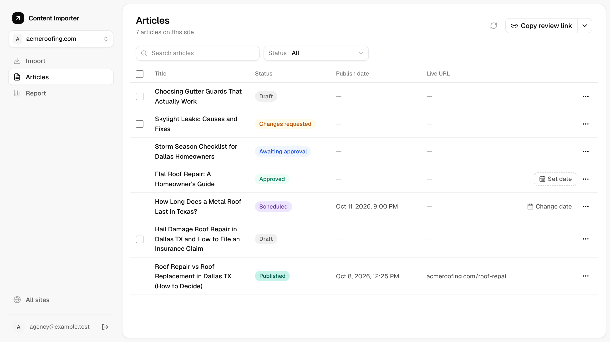

### Import from anywhere
- **Paste** an article from Google Docs, Word or any web page into a rich-text editor. Headings, lists, links, bold and italic survive. Fonts, colors and other leftovers get cleaned away.
- **Upload `.docx` files**, several at once. Each file becomes its own draft.
- The title is picked up from the first heading, and you get a friendly heads-up when something like an image was left out.

| Paste from anywhere | Upload `.docx` files |
| --- | --- |
| 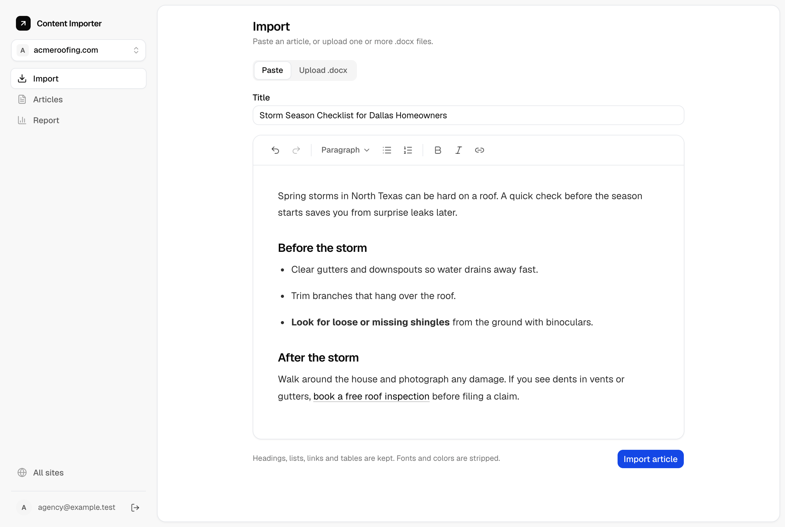 | 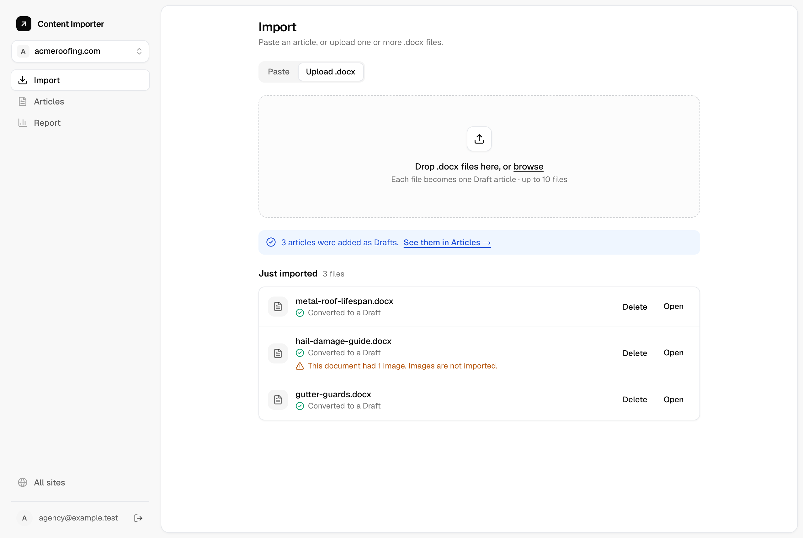 |

### All your client sites in one place
- Manage many WordPress sites from a single dashboard, with a quick site switcher.
- Each site's connection is tested when you add it, and its health shows at a glance.
- WordPress application passwords are encrypted at rest.

| Every client site at a glance | Switch sites in one click |
| --- | --- |
| 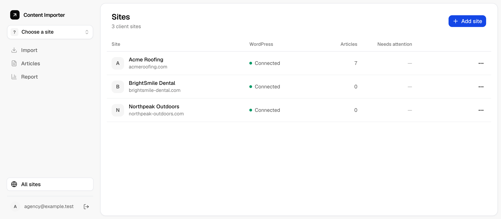 | 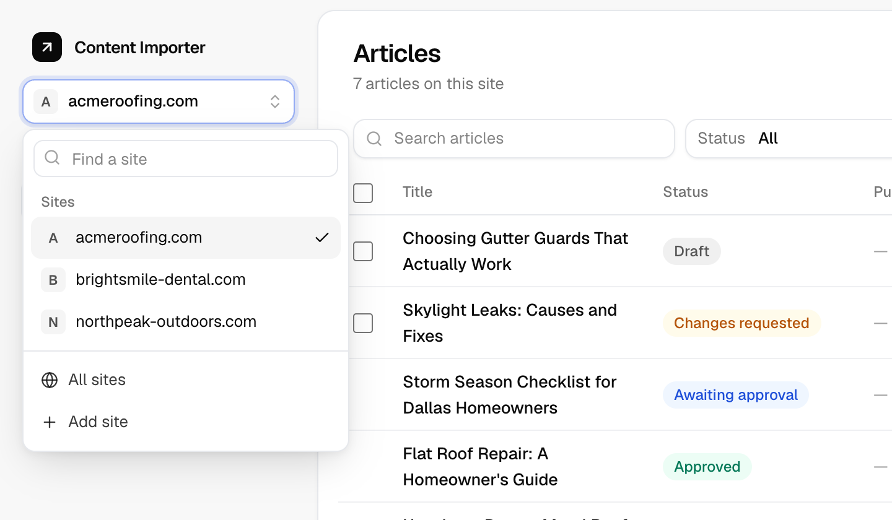 |

### Client approval without friction

<p align="center">
  
</p>

- One private review link per client site. **No account, no password**, and it works beautifully on a phone.
- The client reads each article close to how it will look live, then approves or requests changes with a comment.
- Their name is logged with every decision, so the agency always knows who said yes.

| The client's list | Reading and deciding |
| --- | --- |
| 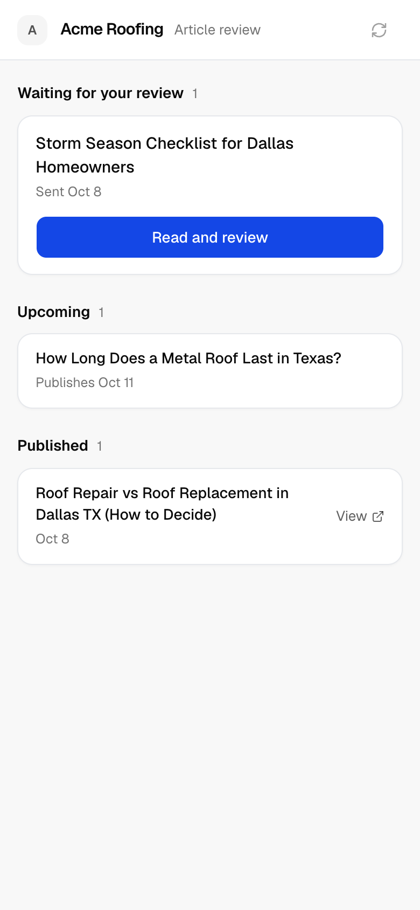 | 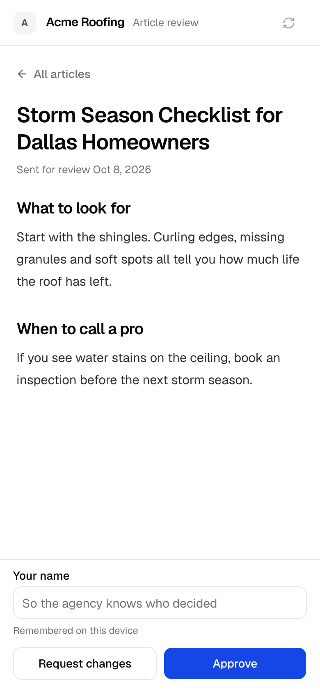 |

When the client asks for changes, their comment lands right on the article, next to the editor and the full activity log:

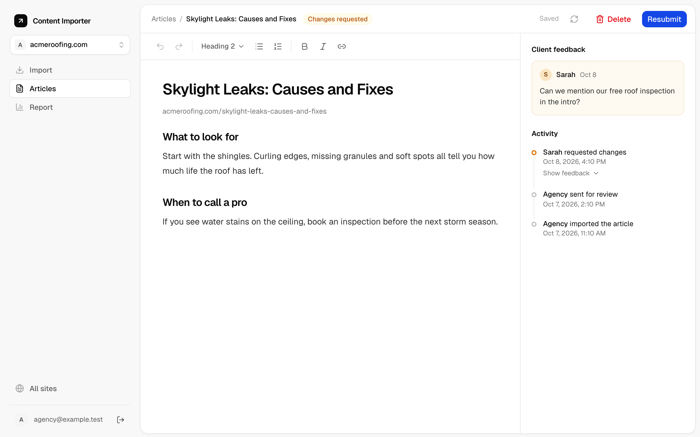

### Schedule and publish
- Pick a date and time, and the article goes live on WordPress on its own.
- Change the date, unschedule, or retry with one click.
- **Nothing reaches WordPress before the client approves it.**

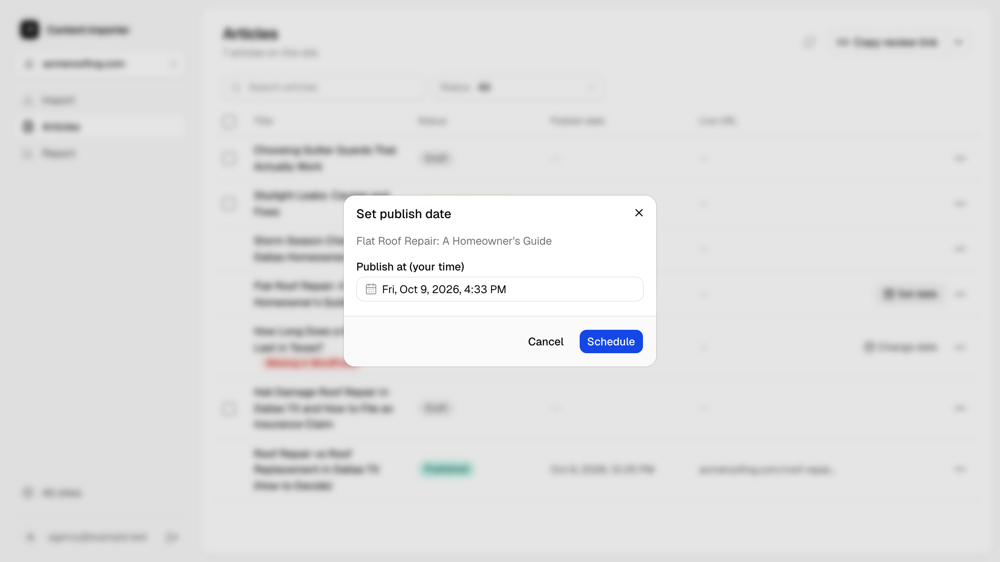

### Always in sync with WordPress
If someone edits a post directly in WordPress, the app notices and flags it: **Late**, **Changed in WordPress** or **Missing in WordPress**. The article's status stays honest either way.

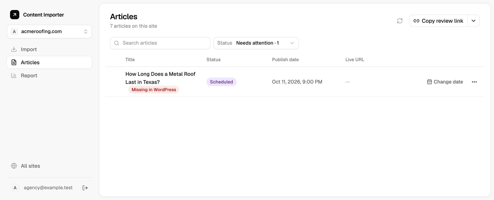

### Reporting
- The agency sees published this month, average time to approval, change rounds per article, what needs attention, and every live URL.
- The client's review page doubles as their own clean report: waiting, upcoming, published.

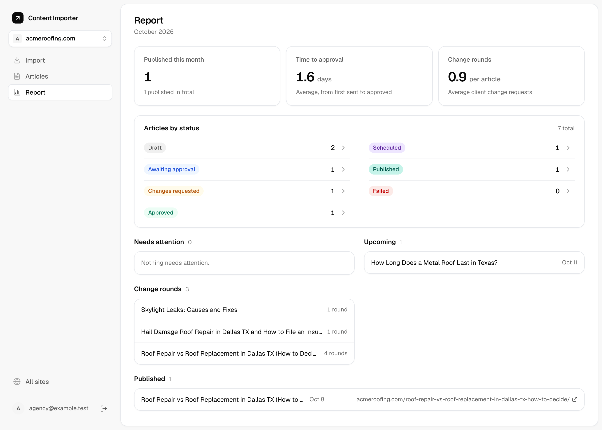

## How I built it, end to end

| Step | What I did | See it |
| --- | --- | --- |
| **Product** | Turned one roadmap sentence into a full spec: users, journeys, the article lifecycle, requirements by priority, the data model and the API. | [`docs/spec.md`](docs/spec.md) |
| **Design** | Designed every screen, desktop and mobile, with Claude on a design canvas that stayed the source of truth for the UI. | [`design/`](design/) |
| **Planning** | Split the work into 7 phases and 47 written tickets, each with its analysis and acceptance criteria. | [`docs/plan/`](docs/plan/README.md) |
| **Engineering** | A FastAPI backend with 320 tests (295 unit tests run in about 10 seconds), and a Next.js frontend with generated API types. | [`server/`](server/), [`web/`](web/) |
| **DevOps** | Production Docker images, Terraform for GCP, GitHub Actions CI and keyless deploys to Cloud Run. | [`infra/`](infra/), [`.github/`](.github/workflows/ci.yml) |

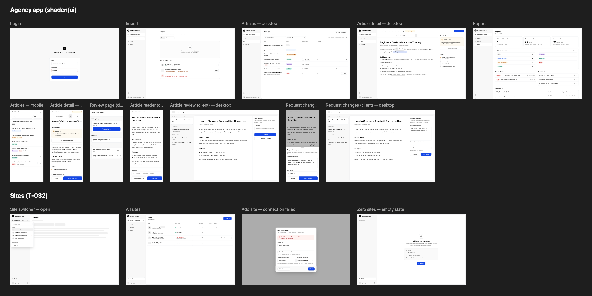

> [!TIP]
> **My AI workflow.** The docs are the source of truth: the spec says *what*, the architecture says *how*, and each ticket says *what's next* and *when it's done*. AI agents work from those written tickets, which makes them fast and reliable. I stay in the loop on every decision and review every diff before it's committed. It's async, well documented and quick, which is how I like to work.

## The article lifecycle

Every article moves through seven statuses. The whole design rests on one promise: **the client approves the exact text that goes live.**

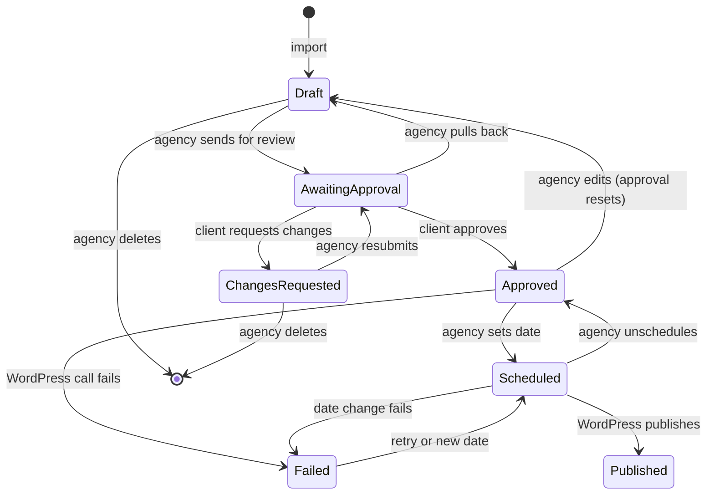

### Rules that protect the client's trust

<p align="center">
  
</p>

- **Edits reset approval.** Change an approved article and it goes back to Draft, so the client signs off on the final words.
- **Locked while waiting.** An article is read-only while the client reviews it or while it's scheduled, so nothing changes underneath anyone.
- **Unscheduling keeps approval.** The text didn't change, so the approval still stands. The WordPress post moves to its trash, where it can be recovered.
- **No stale approvals.** Each approval carries the version the client was reading. If the article changed since, the API refuses with `409 article_changed`, so an old browser tab can never approve text the client hasn't seen.
- **A full history.** Every step is logged with who and when, for example *"Approved by Sarah, Oct 8"*.

## Architecture

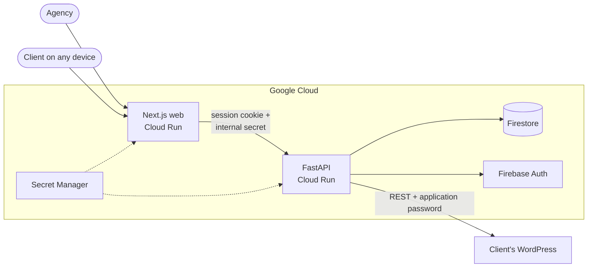

**The browser never talks to the API directly.** The Next.js server makes every API call. On login, the Firebase ID token is exchanged for an `httpOnly` session cookie, which the web server forwards to FastAPI.

### Backend: ports and adapters

```
server/app/
├── core/        business rules: domain, use cases, ports. Pure Python, no SDKs.
├── adapters/    Firestore, WordPress REST, .docx parsing, encryption
├── api/         FastAPI routes: thin, they call use cases
└── container.py wires real adapters (or in-memory ones for tests)
```

- **`core/` never imports an SDK or an HTTP client**, and import-linter enforces that on every CI run.
- The rules (the lifecycle, approval resets, scheduling) live in one place and read like the spec.
- Adapters plug in behind small ports, so the unit tests use in-memory fakes and run in seconds with no services. Integration tests then hit a real Firestore emulator and a real WordPress.
- External adapters log every request and response, which keeps WordPress problems easy to debug.

### Frontend: feature modules

```
web/
├── app/        thin routes: they only compose modules
├── modules/    articles, sites, review, report, auth
│   └── <feature>/ components, pages, repository (queries + mutations)
├── components/ shared UI (shadcn/ui) and shared domain pieces
└── lib/        API client, generated API types, helpers
```

- **Reads happen in Server Components and writes in Server Actions**, so there's no client-side data layer to keep in sync.
- **API types are generated** from FastAPI's OpenAPI schema and never written by hand. CI fails if they drift from the server.
- Every screen works at phone, tablet and desktop widths, with loading, empty, error and "Can't reach WordPress" states.

### Secure by design
- The session cookie is `httpOnly`, `secure` and `sameSite=lax`.
- **Review tokens:** 256-bit, stored only as a SHA-256 hash plus an encrypted copy. A leaked database export can't open a review page.
- WordPress application passwords are encrypted with Fernet. The key lives in Secret Manager, never in the database.
- Client routes are rate-limited per IP, and a wrong token returns 404, so a page never confirms that a link existed.
- On the live app, sign-up is off. Only accounts created by the admin can log in.

## Tech stack

The same stack Adaptify uses: **Python, FastAPI, Firebase and GCP**, with React and Next.js on the front.

| Layer | Tools | Why |
| --- | --- | --- |
| API | Python 3.12, FastAPI, Pydantic | Typed, fast, and its OpenAPI schema feeds the frontend's types |
| Data | Firestore | Document model fits sites → articles → events; serverless |
| Auth | Firebase Auth with session cookies | Managed login, revocable server-side sessions |
| Import | mammoth (`.docx`), nh3 (HTML cleaning) | Faithful conversion, strict allowed-tags list |
| Publishing | WordPress REST API, application passwords | The client's own site, revocable access |
| Web | Next.js 16, React 19, Tailwind, shadcn/ui, Tiptap | Server Components and Actions, a polished editor |
| Infra | Cloud Run, Artifact Registry, Secret Manager, Terraform | Scales to zero, infrastructure as code |
| CI/CD | GitHub Actions, Workload Identity Federation | Every push checked, keyless deploys |
| Tooling | uv, pnpm, Docker Compose, ruff, import-linter, pytest, vitest | Fast, reproducible, enforced boundaries |

## Run it locally

One command starts the whole stack: the API, the web app, the Firebase emulators and a real WordPress.

**You need:** Docker, [uv](https://docs.astral.sh/uv/) and [pnpm](https://pnpm.io/).

```bash
cp .env.example .env    # local defaults, ready to go
make up                 # build and start everything
make wp-setup           # install WordPress and create its application password
make agency-user        # create the agency login in the Auth emulator
```

Then open **http://localhost:3000**, sign in with `AGENCY_EMAIL` and `AGENCY_PASSWORD` from `.env`, and add the local WordPress as a site ([the values to use](docs/architecture.md#local-setup)).

| Service | URL | Stands in for |
| --- | --- | --- |
| Web | http://localhost:3000 | Cloud Run web |
| API | http://localhost:8000/docs | Cloud Run API |
| Firebase emulators | http://localhost:4000 | Firestore and Firebase Auth |
| WordPress | http://localhost:8080 | The client's site |

**Handy commands:**

| Command | What it does |
| --- | --- |
| `make wp-cron` | Publishes any scheduled posts that are due, right now |
| `make lint` | ruff, import-linter, ESLint, Prettier, TypeScript |
| `make test` | Unit tests, server and web, with no services needed |
| `make test-integration` | Integration tests against the emulators and WordPress |
| `make gen-api` | Regenerates the frontend's API types from FastAPI |
| `make logs` | Follows the logs of every service |
| `make help` | Lists every target |

<details>
<summary><b>Environment variables</b></summary>

`.env.example` lists them all with comments. The main ones:

| Variable | Used for |
| --- | --- |
| `APP_ENV` | `local`, `test` or `gcp` |
| `API_URL`, `WEB_BASE_URL` | How the two apps find each other |
| `FIRESTORE_EMULATOR_HOST`, `FIREBASE_AUTH_EMULATOR_HOST` | Point the API at the local emulators |
| `NEXT_PUBLIC_FIREBASE_*` | Firebase config for the browser |
| `AGENCY_EMAIL`, `AGENCY_PASSWORD` | The local agency login |
| `WP_*`, `MARIADB_*` | The local WordPress and its database |
| `CREDENTIAL_ENCRYPTION_KEY` | Encrypts app passwords and review tokens |
| `INTERNAL_API_SECRET` | Lets the web server pass the client's IP to the API |

</details>

## Deploy to Google Cloud

**Serverless and cost-smart.** Both apps run on Cloud Run and scale to zero when idle, so the whole demo fits in GCP's free tier. A billing budget with a kill switch guards against surprises.

| Piece | Where it runs |
| --- | --- |
| Web and API | Cloud Run, `us-central1` |
| Data and logins | Firestore and Firebase Auth (Identity Platform) |
| Secrets | Secret Manager |
| Images | Artifact Registry, keeping the 5 newest versions of each image |
| WordPress | A VPS behind nginx with HTTPS, nightly backups and a real cron ([`infra/wordpress/`](infra/wordpress/)) |

**Infrastructure as code.** One `terraform apply` in [`infra/terraform/`](infra/terraform/) creates everything: services, the database, auth, secrets, the image registry, least-privilege service accounts and the GitHub deploy identity.

<details>
<summary><b>First-time setup</b></summary>

1. `gcloud auth login` and `gcloud auth application-default login`.
2. Create the state bucket: `gcloud storage buckets create gs://content-importer-adaptify-tfstate --location=us-central1 --uniform-bucket-level-access`.
3. In `infra/terraform/`: `terraform init`, then `terraform apply`.
4. Add the two secret values, which never touch Terraform state:
   ```bash
   printf '%s' "<value>" | gcloud secrets versions add CREDENTIAL_ENCRYPTION_KEY --data-file=-
   printf '%s' "<value>" | gcloud secrets versions add INTERNAL_API_SECRET --data-file=-
   ```
5. `terraform apply` again, then create the agency accounts in the Firebase console.

The full guide is in [architecture.md › Terraform](docs/architecture.md#terraform).

</details>

**CI/CD.** Every push and pull request runs three parallel jobs:
- **Server:** lint, import rules and unit tests.
- **Web:** lint, types, tests and a production build.
- **API types:** a check that the frontend's API types still match the server.

Pushes to `main` build the images and deploy them to Cloud Run. GitHub signs in to GCP through **Workload Identity Federation**, so there are no keys stored anywhere.

## What's next: AI change drafting

Change requests are the slowest part of any approval loop. When a client writes *"shorten the intro and mention our free trial"*, the agency will get a ready-made draft of that edit:

- **LangChain** with structured output, on **Gemini via Vertex AI**, traced in **LangSmith**.
- A side-by-side diff. The agency accepts, edits or discards the draft, and the client still approves the final text.
- A monthly spend cap, and output cleaned to the same safe HTML as imported content.

It's fully designed in [the spec](docs/spec.md#ai-drafting-the-requested-change) and up next.

## Docs

| Doc | What it covers |
| --- | --- |
| [Spec](docs/spec.md) | What the system does: scope, journeys, lifecycle, requirements, API |
| [Architecture](docs/architecture.md) | How the code is organized: server, frontend, auth, infra, testing, cost |
| [Workflow](docs/workflow.md) | How the work is planned and done: tickets, conventions, Definition of Done |
| [Plan](docs/plan/README.md) | Phases and the master list of tickets |

## Let's talk 👋

This project is how I'd approach work at Adaptify: own the problem, write it down clearly, build it properly, and ship it. I'd love to build the real version of this with you.

📫 [arifin.muhammad2610@gmail.com](mailto:arifin.muhammad2610@gmail.com) · [linkedin.com/in/arifin2610](https://www.linkedin.com/in/arifin2610/)
