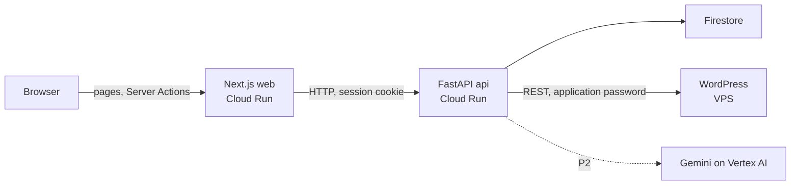

# Content Importer MVP: Architecture

This doc covers **how** the code is organized. For **what** the system does, see [spec.md](spec.md). For how the work is planned and done, see [workflow.md](workflow.md).

## Overview



- The **browser only talks to the Next.js server.** Server Components read data, Server Actions write it. The browser never calls FastAPI directly.
- **FastAPI owns all business rules** (the article lifecycle, approval, scheduling) and is the only service that talks to Firestore, WordPress, and Vertex AI.
- **Firestore** holds the app's own data. **WordPress** holds only the posts the app sends it.

## Tech stack

| Layer                  | Tool                                      | Why                                                                                             |
| ---------------------- | ----------------------------------------- | ----------------------------------------------------------------------------------------------- |
| Backend                | Python 3.12, FastAPI                      | Adaptify stack                                                                                  |
| Database               | Firestore                                 | Adaptify stack (Firebase)                                                                       |
| Agency login           | Firebase Auth                             | Same Firebase project as the database                                                           |
| Frontend               | Next.js, React, TypeScript                | Adaptify stack                                                                                  |
| UI components          | shadcn/ui, Tailwind                       | Copy-in components, no runtime UI library                                                       |
| UI validation          | zod                                       | Form and URL filter schemas                                                                     |
| API types              | `openapi-typescript`                      | Generates TypeScript types from FastAPI's `openapi.json`                                        |
| Package managers       | uv (Python), pnpm (web)                   | Fast installs with lockfiles; uv also manages the Python version                                |
| Rich-text editor       | Tiptap                                    | React editor that keeps headings, lists, and links when text is pasted from Google Docs or Word |
| `.docx` conversion     | `mammoth`                                 | Converts Word structure to HTML                                                                 |
| HTML cleaning          | `nh3`                                     | Keeps only allowed tags and attributes                                                          |
| WordPress client       | `httpx`                                   | Async HTTP calls to the REST API                                                                |
| AI (P2)                | LangChain, LangSmith, Gemini on Vertex AI | Adaptify stack for LangChain and LangSmith                                                      |
| Infrastructure as code | Terraform                                 | Creates every GCP resource                                                                      |
| CI and deploy          | GitHub Actions                            | Tests on every push, deploy on main                                                             |
| WordPress host         | WordPress 6, MariaDB, Caddy, on Docker    | Runs on your VPS                                                                                |


## Server

**Decision:** Use a light hexagonal architecture, also called ports and adapters. The business rules sit in `core/` and never import a cloud SDK or an HTTP client. This lets every outside service swap for a Docker or test version without touching the rules. Full clean architecture adds layers that only pass data along, which is too much for this size.

A **port** is an interface the core depends on, written as a Python `Protocol`. An **adapter** is one concrete version of it. One file, `container.py`, builds the adapters from settings and hands them to the core. This file is the **composition root**: the single place where real objects get created. No DI library: plain constructor arguments plus FastAPI's `Depends` cover it.

### Ports


| Port                | Job                                                              | Real adapter                              | Test adapter                               |
| ------------------- | ---------------------------------------------------------------- | ----------------------------------------- | ------------------------------------------ |
| `DocumentParser`    | Turn pasted HTML or a `.docx` file into clean HTML plus warnings | `mammoth` for `.docx`, `nh3` for cleaning | Same (pure code, no swap needed)           |
| `ArticleRepository` | Read and write one site's articles, events, drafts                | Firestore (emulator locally)              | In-memory                                  |
| `SiteRepository`    | List, create, and look up sites by id or review-token hash        | Firestore (emulator locally)              | In-memory                                  |
| `CredentialCipher`  | Encrypt/decrypt a site's WordPress app password at rest          | Fernet (`cryptography`)                   | Same (pure code, no swap needed)           |
| `Publisher`         | Create, update, and check WordPress posts                        | WordPress REST over `httpx`               | Scripted responses                         |
| `Clock`             | Current time                                                     | System clock                              | Fixed clock, for Late and scheduling tests |
| `LLMGateway`        | Draft a requested change (P2)                                    | Gemini on Vertex AI via LangChain         | Scripted responses                         |
| `SpendGuard`        | Track AI spend and refuse past the limit (P2)                    | Firestore `ai_usage`                      | In-memory                                  |


`mammoth` is a Python library that converts `.docx` to HTML. `nh3` is a fast HTML sanitizer: it keeps only an allowed list of tags and attributes.

### Folder layout

```
content-importer/
├── server/
│   ├── app/
│   │   ├── core/                        # business rules, no SDK or HTTP imports below
│   │   │   ├── domain/
│   │   │   │   ├── models.py            # Site, Article, Event, AiDraft
│   │   │   │   ├── statuses.py          # Status, SyncWarning, EventType
│   │   │   │   ├── lifecycle.py         # allowed transitions and approval rules
│   │   │   │   ├── report.py            # counts, approval speed, change rounds
│   │   │   │   └── errors.py            # NotAllowed, WordPressError, SpendLimitReached
│   │   │   ├── ports/
│   │   │   │   ├── document_parser.py
│   │   │   │   ├── article_repository.py
│   │   │   │   ├── site_repository.py
│   │   │   │   ├── credential_cipher.py
│   │   │   │   ├── publisher.py
│   │   │   │   ├── clock.py
│   │   │   │   ├── llm.py
│   │   │   │   └── spend_guard.py
│   │   │   ├── use_cases/               # one file per user action
│   │   │   │   ├── create_site.py
│   │   │   │   ├── import_article.py    # paste and upload
│   │   │   │   ├── edit_article.py
│   │   │   │   ├── review.py            # send, pull back, approve, request changes
│   │   │   │   ├── review_link.py       # get or create, reset
│   │   │   │   ├── schedule.py          # schedule, change date, retry
│   │   │   │   ├── sync_status.py       # batched WordPress check
│   │   │   │   ├── build_report.py
│   │   │   │   └── draft_change.py      # P2
│   │   │   ├── prompts/
│   │   │   │   └── change_draft.py      # P2: prompt text, version, output schema
│   │   │   └── lib/                     # generic helpers
│   │   │       ├── slug.py
│   │   │       ├── tokens.py            # 256-bit review token (token_urlsafe(32)), SHA-256 hash; see spec R3.1 decision
│   │   │       └── html_rules.py        # allowed tags and attributes
│   │   ├── adapters/                    # the only place SDKs and HTTP clients get imported
│   │   │   ├── firestore/repository.py
│   │   │   ├── firestore/site_repository.py
│   │   │   ├── crypto/fernet_cipher.py
│   │   │   ├── wordpress/publisher.py
│   │   │   ├── documents/parser.py      # mammoth + nh3
│   │   │   ├── vertex/llm.py            # P2
│   │   │   ├── firestore/spend_guard.py # P2
│   │   │   └── testing/                 # in-memory and scripted adapters, incl. in_memory_site_repository.py
│   │   ├── api/
│   │   │   ├── main.py                  # FastAPI app, builds the container
│   │   │   ├── error_handlers.py        # registers every exception -> HTTP mapping
│   │   │   ├── http_errors.py           # API-layer exception classes (not business rules)
│   │   │   ├── deps.py                  # get_site_context / get_public_site_context, shared Depends() getters
│   │   │   ├── auth.py                  # Firebase session cookie check for agency routes
│   │   │   ├── schemas/                 # one module per route, grouping its request/response shapes
│   │   │   │   ├── auth.py
│   │   │   │   ├── sites.py
│   │   │   │   ├── articles.py
│   │   │   │   ├── imports.py
│   │   │   │   ├── public_review.py
│   │   │   │   ├── review_link.py
│   │   │   │   └── report.py
│   │   │   ├── tags.py                  # Swagger section names, in display order
│   │   │   └── routes/
│   │   │       ├── auth.py              # create session cookie from ID token
│   │   │       ├── sites.py             # create and list client sites
│   │   │       ├── articles.py          # mounted under /sites/{site_id}
│   │   │       ├── imports.py           # mounted under /sites/{site_id}
│   │   │       ├── review_link.py       # mounted under /sites/{site_id}
│   │   │       ├── report.py            # mounted under /sites/{site_id}
│   │   │       ├── ai_drafts.py         # P2
│   │   │       └── public_review.py     # token-only routes for the client; resolves its own site
│   │   ├── container.py                 # composition root
│   │   └── settings.py                  # pydantic-settings, APP_ENV = local | gcp | test
│   ├── tests/
│   │   ├── unit/                        # lifecycle rules, use cases with test adapters
│   │   ├── integration/                 # Firestore emulator, local WordPress
│   │   └── fixtures/                    # sample .docx files and pasted HTML
│   ├── Dockerfile
│   └── pyproject.toml                   # deps, ruff, pytest, import-linter
├── web/                                 # Next.js, see Frontend below
├── infra/
│   ├── terraform/                       # GCP only
│   └── wordpress/                       # docker-compose, Caddy, cron for the VPS; local-setup.sh for `make wp-setup`
├── .github/workflows/                   # ci.yml, deploy.yml
├── docker-compose.yml                   # local: api, web, firebase emulator, wordpress, mariadb
├── Makefile
├── .env.example
└── README.md
```

`core/use_cases/` holds one file per user action, not a pipeline of stages.

Swagger at `/docs` groups endpoints by workflow. `api/tags.py` lists the sections, and that list is the order on the page: Health, Auth, Sites, Import, Articles, Publishing, Review link, Report, Client review. Within Import, upload is registered before paste, so it is listed first. A new endpoint takes the tag for its section.

**Decision: `site_id`-in-path plus a `SiteContext` dependency.** Every agency route except `/sites` itself is mounted with `include_router(router, prefix="/sites/{site_id}")`. A single `app/api/deps.py` dependency, `get_site_context`, resolves that path param to a `Site` (404 `site_not_found` if missing) and builds the two things every route needs: an `ArticleRepository` and a `Publisher` scoped to that site. Routes depend on one `SiteContext` object instead of re-resolving a repository and a publisher per handler. The public, token-based client routes use the same `SiteContext` shape, resolved by `get_public_site_context` from the review token's hash instead of a path segment — so a review link never exposes a `site_id`. Future tickets that add another site-scoped route follow this same pattern rather than reading `request.app.state.container` directly.

### Import rules


| Folder                             | May import from                                  | Must never import                                                     |
| ---------------------------------- | ------------------------------------------------ | --------------------------------------------------------------------- |
| `core/domain/`, `core/lib/`        | Standard library, Pydantic                       | Anything else in `app/`                                               |
| `core/ports/`                      | `core/domain/`                                   | Adapters, SDKs                                                        |
| `core/use_cases/`, `core/prompts/` | The rest of `core/`                              | `app/adapters/`, `httpx`, `google.cloud`, `firebase_admin`, `mammoth` |
| `adapters/`                        | `core/domain/`, `core/ports/`, `core/lib/`, SDKs | `core/use_cases/`, `api/`                                             |
| `api/`                             | `core/`, the container                           | Adapters directly                                                     |
| `container.py`                     | Everything                                       | n/a                                                                   |


`import-linter`, a Python tool that fails CI on a forbidden import, enforces this table.

### Logging

Every adapter that calls an external API logs one INFO line per call: method, path, status, and a short summary of the request's and response's identifying fields (ids, slugs, statuses) — never the full payload (e.g. article HTML), to keep logs small and free of sensitive content. On failure, log the upstream error code and message.

This lives in the adapter itself, next to the HTTP call — there's no shared logging port yet, since `WordPressPublisher` is still the only external adapter. Add a small shared helper when a second one (Vertex AI, P2) needs the same pattern, so it isn't copy-pasted.

## Frontend

The web app is a Next.js App Router project in `web/`. It splits into two directories that answer two different questions:

- `app/` — **routing**: which URL maps to which screen?
- `modules/` — **features**: how does that screen actually work?

### Folder layout

```
web/
├── app/                                  # routing only
│   ├── page.tsx                          # → /sites/{first site}/articles, or /sites when there are none
│   ├── (agency)/
│   │   ├── layout.tsx                    # inset sidebar shell with the site switcher
│   │   ├── sites/page.tsx                # all sites; ?add=1 opens the Add site dialog
│   │   └── sites/[siteId]/
│   │       ├── import/page.tsx
│   │       ├── articles/page.tsx         # ?status= and ?q= filters live in the URL
│   │       ├── articles/loading.tsx
│   │       ├── articles/[id]/page.tsx
│   │       └── report/page.tsx
│   ├── login/page.tsx
│   └── review/[token]/                   # client pages: no login, no agency navigation
│       ├── layout.tsx                    # noindex, toaster
│       ├── not-found.tsx                 # "link isn't valid"
│       ├── error.tsx                     # rate limited
│       ├── page.tsx
│       └── articles/[id]/page.tsx
├── modules/
│   ├── articles/                         # import, list, detail
│   │   ├── pages/                        # screen composition: ImportPage, ArticlesPage, ArticleDetailPage
│   │   ├── components/                   # all components of this domain, no smart/dumb split
│   │   ├── data.ts                       # reads: the only data import for pages
│   │   ├── actions.ts                    # writes: importable from client components
│   │   └── repository/                   # articles.queries.ts, articles.mutations.ts ("use server")
│   ├── sites/                            # sites list, Add site dialog, site switcher
│   ├── review/                           # same shape
│   ├── report/
│   └── auth/
├── components/
│   ├── ui/                               # shadcn components
│   └── *.tsx                             # shared: StatusBadge, SyncWarningBadge, WordPressBanner, LocalTime, PageHeader, ArticleEditor
├── hooks/
│   ├── use-filter-params.ts
│   └── use-mobile.ts
└── lib/
    ├── http.ts                           # generic HttpClient + ApiError
    ├── api-server.ts                     # server-only client: base URL, cookie, client IP
    ├── api/schema.ts                     # GENERATED from FastAPI openapi.json, never edited
    ├── api/types.ts                      # ApiResponse<>, Schemas alias
    ├── error-messages.ts                 # messageFor(code)
    ├── mutation-result.ts                # MutationResult, toResult, orNotFound
    ├── types/page-props.ts
    └── query-string.ts
├── proxy.ts                              # optimistic session-cookie redirect (Next 16's middleware)
├── Dockerfile
└── .dockerignore
```

Import has no module of its own. An import just creates articles, so it lives in `articles/`.

### Rules

**Thin routes.** A file in `app/` maps a URL to a module page and does nothing else: no data fetching, no business logic.

```tsx
// app/(agency)/articles/[id]/page.tsx
import { ArticleDetailPage } from "@/modules/articles/pages/ArticleDetailPage"
import type { PageProps } from "@/lib/types/page-props"

export default async function Page({ params }: PageProps<{ id: string }>) {
  const { id } = await params
  return <ArticleDetailPage articleId={id} />
}
```

**Module pages compose, components own their data.** A module page assembles the components a screen needs and passes down IDs. Each component fetches the data it actually needs, instead of one page fetching everything.

**The data seam.** Pages and components get data only from `modules/<m>/data.ts` (reads) and `modules/<m>/actions.ts` (writes). Both are one-line re-exports of the module's `repository/`. Writes have their own file because a client component can't import a module that also pulls in `server-only` reads.

**Reads are Server Components, writes are Server Actions.**

| Kind | File | Directive | Runs |
| --- | --- | --- | --- |
| Read | `repository/*.queries.ts` | none | On the server, inside Server Components |
| Write | `repository/*.mutations.ts` | `"use server"` | On the server, called from Client Components |
| Interactive UI | `components/*.tsx` | `"use client"` | In the browser |

Mark a function `"use server"` only if a Client Component calls it. After a write, the mutation calls `revalidatePath` so the Server Components fetch fresh data. There is no client-side data library (no TanStack Query).

**The API client.** `lib/http.ts` holds a generic `HttpClient` with `get`, `post`, `patch`, `delete`, and `postForm` (multipart, for `.docx` upload). `lib/api-server.ts` creates the one instance the app uses. It imports `server-only`, so the build fails if browser code ever imports it. On every request it adds:
- the agency session cookie (see [Auth](#auth)), and
- the client's IP in `X-Forwarded-For`, so FastAPI can rate-limit per client.

**Types come from the API.** FastAPI publishes `openapi.json` from its Pydantic schemas. `openapi-typescript` turns it into `lib/api/schema.ts` (`pnpm gen:api`). Request and response types are taken from there, so the frontend and server can't drift apart. There is no shared contracts package, since the server is Python. When the API changes, regenerate the file and fix what the type checker reports.

**Validation.** Forms use native `required` and small inline checks; FastAPI does the real validation and its error codes are shown with `messageFor`. No zod schemas until a form needs more than that.

**Expected errors are returned, not thrown.** In production, Next.js removes the message of an error thrown from a Server Action. So mutations return a result:

```ts
type MutationResult<T> = { ok: true; data: T } | { ok: false; code: string }
```

`code` carries the API's error code, for example `article_changed` or `not_awaiting_approval`. Every mutation wraps its API call in `toResult` (`lib/mutation-result.ts`): a 4xx becomes `{ ok: false, code }`, and so does `wordpress_error` (a 502: WordPress refused, the API is fine and has already saved the article as Failed, so article mutations revalidate on it too). Anything else is thrown to the route's `error.tsx`. Reads wrap theirs in `orNotFound`, so an API 404 renders Next's not-found page. A 401 never reaches either: `apiServer()` redirects to `/login` first.

**Reads that need their own state are data, not thrown.** Next.js also hides a thrown Server Component error's message in production, so `error.tsx` can't tell errors apart. The review pages' 429 comes back from `review.queries.ts` as `null` and renders the rate-limit screen; only the unexpected reaches `error.tsx`.

**Unknown sites 404 in one place.** `app/(agency)/sites/[siteId]/layout.tsx` checks the id against `listSites()` and calls `notFound()`, so every site route (Import included, which reads nothing site-scoped) 404s the same way. `listSites` is wrapped in React `cache()`, so the agency layout and this guard share one request.

**Last opened site.** `proxy.ts` stores the `{id}` of every `/sites/{id}/...` visit in an `httpOnly` `last_site` cookie (`lib/last-site.ts`). `/` redirects there when the site still exists, else to the first site, and the Sites list marks it "Current".

**Forms submit with `onSubmit`, not `action`.** React 19 resets a form after its `action` runs, which empties uncontrolled fields after an error (a wrong password, `wp_connection_failed`, a past publish date). Forms that can fail use `onSubmit` with `preventDefault()` and build `FormData` themselves.

**Filters live in the URL.** The articles status filter is a search param. Filter components call `useFilterParams().setParams({...})`, which merges changes into the current URL. The Server Component reads `searchParams` and refetches. Filtered views can be bookmarked, and the back button works.

**Upload size.** Server Actions accept 1 MB request bodies by default. `next.config` raises `serverActions.bodySizeLimit` so several `.docx` files fit in one upload.

**Shared domain components.** Components used by more than one module (status and sync warning badges, the "Can't reach WordPress" banner, `LocalTime`) live in `components/`, not in a module.

**Dates.** Server Components render in the server's timezone (UTC). Every date shown to a user goes through `LocalTime`, a client component that formats in the browser's timezone.

**Responsive.** Mobile-first Tailwind. Every screen works at 375, 768, and 1280px with no horizontal scroll. Lists are tables at `md` (768px) and up, stacked rows below. The agency sidebar (shadcn Sidebar, `inset` variant) is expanded at `lg`, an icon rail between `md` and `lg`, and a Sheet behind the menu button below `md`; `PageHeader` puts that button, the title and the page's actions in one bar on phones. The client review is one 3-column page at `lg` and up (list, reader, decision panel); below `lg` the list and the reader are separate screens.

**Design tokens.** `app/globals.css` holds the canvas tokens on top of shadcn's: the border color, `--app` (the shell background behind the inset panel), `--faint` text, and a background/foreground pair per status (`--status-draft` … `--status-failed`) that `StatusBadge` uses. Primary blue goes only on the one primary action per screen. The font is Geist.

**Editor.** The import and detail screens use one Tiptap editor (`components/article-editor.tsx`): StarterKit (which includes Link in Tiptap 3) and `TableKit`, with a toolbar and a bubble menu on selection. Its extensions are limited to the tags the server's nh3 list keeps (h2–h4, p, lists, a, strong, em, table), so the editor never produces markup the server strips. `editable={false}` makes it a reader. The body typography (`components/prose.ts`) is shared with the client reader.

**Review page HTML.** The reader renders the article body with `dangerouslySetInnerHTML`. The server already cleans every body with nh3 at import and on every edit, so the browser adds no second sanitizer.

## Auth

**Agency.** The agency signs in with Firebase Auth. Because the browser never calls FastAPI, the login has to end in a cookie the Next server can forward:

1. The login page signs in with the Firebase JS SDK and gets an ID token.
2. A Server Action sends the ID token to `POST /auth/session` on FastAPI, which creates a Firebase **session cookie** with `firebase_admin.auth.create_session_cookie`.
3. The Server Action sets it on the browser as an `httpOnly`, `secure`, `sameSite=lax` cookie.
4. `lib/api-server.ts` forwards the cookie on every request. FastAPI's `auth.py` checks it with `verify_session_cookie`.
5. `proxy.ts` redirects agency paths to `/login?next=…` when there's no `session` cookie. This check is optimistic: it sees the cookie, not whether it's valid.
6. The real check is the API: `lib/api-server.ts` turns a 401 from any agency call into a redirect to `/login?next=…&expired=1`, so an expired, revoked, or tampered cookie fails on the first query of the page. There is no separate session-check endpoint.
7. On `/login?expired=1`, `proxy.ts` deletes the rejected `session` cookie (otherwise its "already signed in" redirect would loop back to `/`), and the login page says "Please sign in again." A plain logged-out visit (step 5) shows no such notice.

`next` is used only when it's a relative path (starts with `/`, not `//`), which blocks open redirects. Logout is a Server Action that deletes the cookie; there's no server-side revoke while there's one agency user. Locally the same flow runs against the Firebase Auth emulator; `make agency-user` creates the one account there.

**Client.** The review pages need no login. The review token in the URL is the only credential (see the spec's API endpoints decisions). The review layout has no agency navigation and sets `noindex`. `next.config` sends `Referrer-Policy: no-referrer` on `/review/*`, so clicking a live-page link doesn't leak the token to the client's site through the Referer header. A bad or reset token shows a generic 404 page that doesn't confirm the link ever existed.

## Infrastructure

The app runs on GCP. WordPress runs on your own VPS in Docker. Locally, everything runs in one `docker compose` setup, so you can build and test the full flow at zero cost.


### GCP services


| Service                                             | Use                                                      |
| --------------------------------------------------- | -------------------------------------------------------- |
| Cloud Run                                           | Two services: API and web. Both scale to zero when idle. |
| Firestore                                           | All app data                                             |
| Firebase Auth                                       | One agency login                                         |
| Secret Manager                                      | `CREDENTIAL_ENCRYPTION_KEY` (encrypts each site's WordPress app password in Firestore); LangSmith key (P2) |
| Artifact Registry                                   | Docker images                                            |
| Vertex AI                                           | Gemini, for P2 only                                      |
| Cloud Billing budget + Pub/Sub + one small function | Spending alert and kill switch (see Cost and limits)     |
| Cloud Logging                                       | Logs and errors, included with Cloud Run                 |


**Decision:** Deploy in `us-central1`, a Tier 1 region with the full Cloud Run free tier.

### WordPress on the VPS

- **Containers:** WordPress, MariaDB, and Caddy. Caddy is a reverse proxy, a small server in front of WordPress that gets and renews a free HTTPS certificate automatically.
- **Domain:** a subdomain such as `wp.yourdomain.com` pointing at the VPS. The certificate needs it.
- **Scheduling on time:** `DISABLE_WP_CRON` turns off WordPress's visit-based scheduler. A system cron job calls `wp-cron.php` every minute, so scheduled posts go live on time even with zero visitors.
- **Safety:** open only ports 22, 80, and 443. Use a strong admin password, keep WordPress updated, and back up the database and `wp-content` volume.


### Local setup


| Service                 | Stands in for                                                                                   |
| ----------------------- | ----------------------------------------------------------------------------------------------- |
| `api`                   | Cloud Run API, with `APP_ENV=local`                                                             |
| `web`                   | Cloud Run web, Next.js dev server                                                               |
| `firebase`              | Firestore and Firebase Auth emulators                                                           |
| `wordpress` + `mariadb` | The VPS WordPress, with `WP_ENVIRONMENT_TYPE=local` so application passwords work without HTTPS |


The Firestore adapter needs no code swap locally: setting `FIRESTORE_EMULATOR_HOST` points the same code at the emulator. The WordPress adapter only changes its base URL and password.

**Adding the local WordPress as a site.** Run `make wp-setup` first; it writes the application password to `.env` (`WP_APP_PASSWORD`). Then, in Add site:

| Field | Value | Why |
| --- | --- | --- |
| WordPress URL | `http://wordpress` | The API calls WordPress from its container, where `localhost:8080` is the API itself. `wordpress` is the compose service name. Post links still use `localhost:8080`, WordPress's own address. |
| WordPress username | `admin` | The account `make wp-setup` creates |
| Application password | `WP_APP_PASSWORD` from `.env` | Not the admin login password |

**http:// is local only.** An `http://` URL sends the app password unencrypted. The API rejects one with `422 insecure_url` unless `APP_ENV` is `local` or `test` (`Container.allow_http_wordpress`), and the Add/Edit site dialog only accepts and mentions `http://` when the web app's `APP_ENV` is `local`.

Set `CREDENTIAL_ENCRYPTION_KEY` in `.env`. Without it the API makes a new key on each start, and sites saved earlier no longer decrypt (they show as unreachable).

## Deployment and CI

Terraform manages GCP only. The VPS gets set up once by hand from the files in `infra/wordpress/`. GitHub Actions runs the tests and deploys the app.

### Environments


| Environment | App                          | WordPress                 |
| ----------- | ---------------------------- | ------------------------- |
| Local       | `docker compose up`          | Local WordPress container |
| Demo        | GCP project in `us-central1` | Your VPS                  |


### What Terraform creates

- **APIs:** Run, Firestore, Secret Manager, Artifact Registry, Billing Budgets, Pub/Sub, and Vertex AI (P2).
- **Service accounts:** one for the API, one for the web service. Each gets only the roles it needs.
- **Compute:** Cloud Run services for API and web.
- **Data:** Firestore database.
- **Secrets:** Secret Manager entries for `CREDENTIAL_ENCRYPTION_KEY` and the LangSmith key. You add the values by hand once, so they never sit in Terraform state. Each site's own WordPress app password lives encrypted in Firestore, not in Secret Manager (see spec.md's Data model).
- **Cost backstop:** billing budget, Pub/Sub topic, and the kill-switch function.

The Terraform state bucket is the one GCP resource you create by hand, before the first `terraform init`.

### VPS setup, once

1. Install Docker on the VPS.
2. Copy `infra/wordpress/`, fill in `.env` (database password, domain), and run `docker compose up -d`.
3. Add the system cron job that calls `wp-cron.php` every minute.
4. Finish the WordPress install in the browser, then create an application password under the admin user's profile.
5. Add the site through `POST /sites` (or the agency UI's Add Site screen), which stores the URL and app password encrypted in Firestore.


### CI pipeline

1. `ci.yml`, on every push: `ruff` lint, `import-linter`, unit tests, then integration tests against the Firestore emulator and a WordPress container.
2. `deploy.yml`, on main: build the API and web images, push them to Artifact Registry tagged with the commit hash, then run `terraform apply` with the new tags.

**Decision:** GitHub logs in to GCP with Workload Identity Federation instead of a JSON key file. Each run gets a short-lived token, so no long-lived secret sits in the repo settings.

## Testing

Tests follow the architecture. The lifecycle rules get the most tests, because a bug there can publish text the client never approved.


| Level       | What it covers                                                                                                                   | Runs against                       |
| ----------- | -------------------------------------------------------------------------------------------------------------------------------- | ---------------------------------- |
| Unit        | Every status and action pair, allowed or refused. The approval reset rules. Sync status mapping. Report math with a fixed clock. | Test adapters, no network          |
| Unit        | Paste and `.docx` cleaning: headings, lists, links kept; styles stripped; image warning raised                                   | Fixture files in `tests/fixtures/` |
| Integration | Firestore repository reads and writes                                                                                            | Firestore emulator                 |
| Integration | WordPress adapter: create a scheduled post, change its date, move it to draft, find it by slug, batch status check               | Local WordPress container          |
| End to end  | Paste, send for review, approve through the client route, schedule one minute ahead, call `wp-cron.php`, see Published           | Full local `docker compose`        |
| AI (P2)     | About 15 change requests, reviewed by hand after each prompt change                                                              | LangSmith dataset                  |


**Decision:** The end-to-end test triggers WordPress's scheduler directly by calling `wp-cron.php`, so it never waits on a timer.

## Cost and limits

The monthly target is **$5** and the absolute maximum is **$10**, because the project runs on a personal GCP account. Without AI, the app fits inside GCP's free tiers. The VPS is outside this budget, since you already pay for it.


| Item                                         | Expected monthly cost                                                                                                                                             |
| -------------------------------------------- | ----------------------------------------------------------------------------------------------------------------------------------------------------------------- |
| Cloud Run (API and web, scale to zero)       | $0. The free tier covers 180,000 vCPU-seconds, 360,000 GiB-seconds, and 2 million requests per month ([Cloud Run pricing](https://cloud.google.com/run/pricing)). |
| Firestore, Secret Manager, Artifact Registry | $0 to cents. Free quotas cover this scale (**approximate**, from memory, not checked).                                                                            |
| AI change drafts (P2)                        | Under one cent per draft                                                                                                                                          |


### Limits


| Limit                       | Value                         | What happens                                                                                                                                    |
| --------------------------- | ----------------------------- | ----------------------------------------------------------------------------------------------------------------------------------------------- |
| AI spend per month (in-app) | $2                            | `SpendGuard` refuses new drafts until the next month. The button shows why.                                                                     |
| AI output size per draft    | Capped by `max_output_tokens` | Keeps one call's worst case under one cent, so the limit can only overshoot by one draft.                                                       |
| GCP budget alert            | $5                            | Email to you                                                                                                                                    |
| GCP budget kill switch      | $8                            | A Pub/Sub message triggers a small function that disables billing on the project. Every paid service stops until you re-enable billing by hand. |


**Decision:** The kill switch fires at $8, not $10, because GCP billing data arrives hours late. The $2 gap absorbs spend that happens before the alert lands.

**Decision:** Run the app in a GCP project that holds nothing else, so the kill switch can't stop anything you care about.

**Decision:** Keep Cloud Run's minimum instances at 0. The first request after idle takes a few seconds longer (a cold start), which is fine for an MVP.
