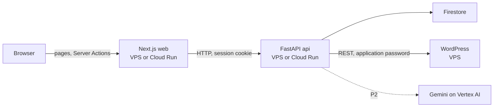

# Content Importer MVP: Architecture

This doc covers **how** the code is organized. For **what** the system does, see [spec.md](spec.md). For how the work is planned and done, see [workflow.md](workflow.md).

## Overview



- The **browser only talks to the Next.js server.** Server Components read data, Server Actions write it. The browser never calls FastAPI directly.
- **FastAPI owns all business rules** (the article lifecycle, approval, scheduling) and is the only service that talks to Firestore, WordPress, and Vertex AI.
- **Firestore** holds the app's own data. **WordPress** holds only the posts the app sends it.

## Tech stack

| Layer                  | Tool                                      | Why                                                                                             |
| ---------------------- | ----------------------------------------- | ----------------------------------------------------------------------------------------------- |
| Backend                | Python 3.12, FastAPI                      | Adaptify stack                                                                                  |
| Database               | Firestore                                 | Adaptify stack (Firebase)                                                                       |
| Agency login           | Firebase Auth                             | Same Firebase project as the database                                                           |
| Frontend               | Next.js, React, TypeScript                | Adaptify stack                                                                                  |
| UI components          | shadcn/ui, Tailwind                       | Copy-in components, no runtime UI library                                                       |
| UI validation          | zod                                       | Form and URL filter schemas                                                                     |
| API types              | `openapi-typescript`                      | Generates TypeScript types from FastAPI's `openapi.json`                                        |
| Package managers       | uv (Python), pnpm (web)                   | Fast installs with lockfiles; uv also manages the Python version                                |
| Rich-text editor       | Tiptap                                    | React editor that keeps headings, lists, and links when text is pasted from Google Docs or Word |
| `.docx` conversion     | `mammoth`                                 | Converts Word structure to HTML                                                                 |
| HTML cleaning          | `nh3`                                     | Keeps only allowed tags and attributes                                                          |
| WordPress client       | `httpx`                                   | Async HTTP calls to the REST API                                                                |
| AI (P2)                | LangChain, LangSmith, Gemini on Vertex AI | Adaptify stack for LangChain and LangSmith                                                      |
| CI and deploy          | GitHub Actions, GHCR                      | Tests on every push; a green push to main deploys to the VPS                                    |
| Infrastructure as code | Terraform                                 | Creates every GCP resource, for the GCP target                                                  |
| WordPress host         | WordPress 6 and MariaDB on Docker, nginx  | Runs on your VPS                                                                                |


## Server

**Decision:** Use a light hexagonal architecture, also called ports and adapters. The business rules sit in `core/` and never import a cloud SDK or an HTTP client. This lets every outside service swap for a Docker or test version without touching the rules. Full clean architecture adds layers that only pass data along, which is too much for this size.

A **port** is an interface the core depends on, written as a Python `Protocol`. An **adapter** is one concrete version of it. One file, `container.py`, builds the adapters from settings and hands them to the core. This file is the **composition root**: the single place where real objects get created. No DI library: plain constructor arguments plus FastAPI's `Depends` cover it.

### Ports


| Port                | Job                                                              | Real adapter                              | Test adapter                               |
| ------------------- | ---------------------------------------------------------------- | ----------------------------------------- | ------------------------------------------ |
| `DocumentParser`    | Turn pasted HTML or a `.docx` file into clean HTML plus warnings | `mammoth` for `.docx`, `nh3` for cleaning | Same (pure code, no swap needed)           |
| `ArticleRepository` | Read and write one site's articles, events, drafts                | Firestore (emulator locally)              | In-memory                                  |
| `SiteRepository`    | List, create, and look up sites by id or review-token hash        | Firestore (emulator locally)              | In-memory                                  |
| `CredentialCipher`  | Encrypt/decrypt a site's WordPress app password at rest          | Fernet (`cryptography`)                   | Same (pure code, no swap needed)           |
| `Publisher`         | Create, update, and check WordPress posts                        | WordPress REST over `httpx`               | Scripted responses                         |
| `Clock`             | Current time                                                     | System clock                              | Fixed clock, for Late and scheduling tests |
| `LLMGateway`        | Draft a requested change (P2)                                    | Gemini on Vertex AI via LangChain         | Scripted responses                         |
| `SpendGuard`        | Track AI spend and refuse past the limit (P2)                    | Firestore `ai_usage`                      | In-memory                                  |


`mammoth` is a Python library that converts `.docx` to HTML. `nh3` is a fast HTML sanitizer: it keeps only an allowed list of tags and attributes.

### Folder layout

```
content-importer/
├── server/
│   ├── app/
│   │   ├── core/                        # business rules, no SDK or HTTP imports below
│   │   │   ├── domain/
│   │   │   │   ├── models.py            # Site, Article, Event, AiDraft
│   │   │   │   ├── statuses.py          # Status, SyncWarning, EventType
│   │   │   │   ├── lifecycle.py         # allowed transitions and approval rules
│   │   │   │   ├── report.py            # counts, approval speed, change rounds
│   │   │   │   └── errors.py            # NotAllowed, WordPressError, SpendLimitReached
│   │   │   ├── ports/
│   │   │   │   ├── document_parser.py
│   │   │   │   ├── article_repository.py
│   │   │   │   ├── site_repository.py
│   │   │   │   ├── credential_cipher.py
│   │   │   │   ├── publisher.py
│   │   │   │   ├── clock.py
│   │   │   │   ├── llm.py
│   │   │   │   └── spend_guard.py
│   │   │   ├── use_cases/               # one file per user action
│   │   │   │   ├── create_site.py
│   │   │   │   ├── import_article.py    # paste and upload
│   │   │   │   ├── edit_article.py
│   │   │   │   ├── review.py            # send, pull back, approve, request changes
│   │   │   │   ├── review_link.py       # get or create, reset
│   │   │   │   ├── schedule.py          # schedule, change date, retry
│   │   │   │   ├── sync_status.py       # batched WordPress check
│   │   │   │   ├── build_report.py
│   │   │   │   └── draft_change.py      # P2
│   │   │   ├── prompts/
│   │   │   │   └── change_draft.py      # P2: prompt text, version, output schema
│   │   │   └── lib/                     # generic helpers
│   │   │       ├── slug.py
│   │   │       ├── tokens.py            # 256-bit review token (token_urlsafe(32)), SHA-256 hash; see spec R3.1 decision
│   │   │       └── html_rules.py        # allowed tags and attributes
│   │   ├── adapters/                    # the only place SDKs and HTTP clients get imported
│   │   │   ├── firestore/repository.py
│   │   │   ├── firestore/site_repository.py
│   │   │   ├── crypto/fernet_cipher.py
│   │   │   ├── wordpress/publisher.py
│   │   │   ├── documents/parser.py      # mammoth + nh3
│   │   │   ├── vertex/llm.py            # P2
│   │   │   ├── firestore/spend_guard.py # P2
│   │   │   └── testing/                 # in-memory and scripted adapters, incl. in_memory_site_repository.py
│   │   ├── api/
│   │   │   ├── main.py                  # FastAPI app, builds the container
│   │   │   ├── error_handlers.py        # registers every exception -> HTTP mapping
│   │   │   ├── http_errors.py           # API-layer exception classes (not business rules)
│   │   │   ├── deps.py                  # get_site_context / get_public_site_context, shared Depends() getters
│   │   │   ├── auth.py                  # Firebase session cookie check for agency routes
│   │   │   ├── schemas/                 # one module per route, grouping its request/response shapes
│   │   │   │   ├── auth.py
│   │   │   │   ├── sites.py
│   │   │   │   ├── articles.py
│   │   │   │   ├── imports.py
│   │   │   │   ├── public_review.py
│   │   │   │   ├── review_link.py
│   │   │   │   └── report.py
│   │   │   ├── tags.py                  # Swagger section names, in display order
│   │   │   └── routes/
│   │   │       ├── auth.py              # create session cookie from ID token
│   │   │       ├── sites.py             # create and list client sites
│   │   │       ├── articles.py          # mounted under /sites/{site_id}
│   │   │       ├── imports.py           # mounted under /sites/{site_id}
│   │   │       ├── review_link.py       # mounted under /sites/{site_id}
│   │   │       ├── report.py            # mounted under /sites/{site_id}
│   │   │       ├── ai_drafts.py         # P2
│   │   │       └── public_review.py     # token-only routes for the client; resolves its own site
│   │   ├── container.py                 # composition root
│   │   └── settings.py                  # pydantic-settings, APP_ENV = local | prod | test
│   ├── tests/
│   │   ├── unit/                        # lifecycle rules, use cases with test adapters
│   │   ├── integration/                 # Firestore emulator, local WordPress
│   │   └── fixtures/                    # sample .docx files and pasted HTML
│   ├── Dockerfile
│   └── pyproject.toml                   # deps, ruff, pytest, import-linter
├── web/                                 # Next.js, see Frontend below
├── infra/
│   ├── app/                             # VPS: the app's docker-compose, nginx site, .env.example
│   ├── terraform/                       # GCP: Cloud Run, Firestore, Auth, secrets
│   └── wordpress/                       # VPS: docker-compose, nginx site, backup.sh, crontab; local-setup.sh for `make wp-setup`
├── .github/workflows/                   # ci.yml (checks, then deploy on main)
├── docker-compose.yml                   # local: api, web, firebase emulator, wordpress, mariadb
├── Makefile
├── .env.example
└── README.md
```

`core/use_cases/` holds one file per user action, not a pipeline of stages.

Swagger at `/docs` groups endpoints by workflow. `api/tags.py` lists the sections, and that list is the order on the page: Health, Auth, Sites, Import, Articles, Publishing, Review link, Report, Client review. Within Import, upload is registered before paste, so it is listed first. A new endpoint takes the tag for its section.

**Decision: `site_id`-in-path plus a `SiteContext` dependency.** Every agency route except `/sites` itself is mounted with `include_router(router, prefix="/sites/{site_id}")`. A single `app/api/deps.py` dependency, `get_site_context`, resolves that path param to a `Site` (404 `site_not_found` if missing) and builds the two things every route needs: an `ArticleRepository` and a `Publisher` scoped to that site. Routes depend on one `SiteContext` object instead of re-resolving a repository and a publisher per handler. The public, token-based client routes use the same `SiteContext` shape, resolved by `get_public_site_context` from the review token's hash instead of a path segment — so a review link never exposes a `site_id`. Future tickets that add another site-scoped route follow this same pattern rather than reading `request.app.state.container` directly.

### Import rules


| Folder                             | May import from                                  | Must never import                                                     |
| ---------------------------------- | ------------------------------------------------ | --------------------------------------------------------------------- |
| `core/domain/`, `core/lib/`        | Standard library, Pydantic                       | Anything else in `app/`                                               |
| `core/ports/`                      | `core/domain/`                                   | Adapters, SDKs                                                        |
| `core/use_cases/`, `core/prompts/` | The rest of `core/`                              | `app/adapters/`, `httpx`, `google.cloud`, `firebase_admin`, `mammoth` |
| `adapters/`                        | `core/domain/`, `core/ports/`, `core/lib/`, SDKs | `core/use_cases/`, `api/`                                             |
| `api/`                             | `core/`, the container                           | Adapters directly                                                     |
| `container.py`                     | Everything                                       | n/a                                                                   |


`import-linter`, a Python tool that fails CI on a forbidden import, enforces this table.

### Logging

Every adapter that calls an external API logs one INFO line per call: method, path, status, and a short summary of the request's and response's identifying fields (ids, slugs, statuses) — never the full payload (e.g. article HTML), to keep logs small and free of sensitive content. On failure, log the upstream error code and message.

This lives in the adapter itself, next to the HTTP call — there's no shared logging port yet, since `WordPressPublisher` is still the only external adapter. Add a small shared helper when a second one (Vertex AI, P2) needs the same pattern, so it isn't copy-pasted.

## Frontend

The web app is a Next.js App Router project in `web/`. It splits into two directories that answer two different questions:

- `app/` — **routing**: which URL maps to which screen?
- `modules/` — **features**: how does that screen actually work?

### Folder layout

```
web/
├── app/                                  # routing only
│   ├── page.tsx                          # → /sites/{first site}/articles, or /sites when there are none
│   ├── (agency)/
│   │   ├── layout.tsx                    # inset sidebar shell with the site switcher
│   │   ├── sites/page.tsx                # all sites; ?add=1 opens the Add site dialog
│   │   └── sites/[siteId]/
│   │       ├── import/page.tsx
│   │       ├── articles/page.tsx         # ?status= and ?q= filters live in the URL
│   │       ├── articles/loading.tsx
│   │       ├── articles/[id]/page.tsx
│   │       └── report/page.tsx
│   ├── login/page.tsx
│   └── review/[token]/                   # client pages: no login, no agency navigation
│       ├── layout.tsx                    # noindex, toaster
│       ├── not-found.tsx                 # "link isn't valid"
│       ├── error.tsx                     # unexpected errors (a 429 renders RateLimited instead)
│       ├── page.tsx
│       └── articles/[id]/page.tsx
├── modules/
│   ├── articles/                         # import, list, detail
│   │   ├── pages/                        # screen composition: ImportPage, ArticlesPage, ArticleDetailPage
│   │   ├── components/                   # all components of this domain, no smart/dumb split
│   │   ├── data.ts                       # reads: the only data import for pages
│   │   ├── actions.ts                    # writes: importable from client components
│   │   └── repository/                   # articles.queries.ts, articles.mutations.ts ("use server")
│   ├── sites/                            # sites list, Add site dialog, site switcher
│   ├── review/                           # same shape
│   ├── report/
│   └── auth/
├── components/
│   ├── ui/                               # shadcn components
│   └── *.tsx                             # shared: StatusBadge, SyncWarningBadge, WordPressBanner, LocalTime, PageHeader, ArticleEditor
├── hooks/
│   ├── use-filter-params.ts
│   └── use-mobile.ts
└── lib/
    ├── http.ts                           # generic HttpClient + ApiError
    ├── api-server.ts                     # server-only client: base URL, cookie, client IP
    ├── api/schema.ts                     # GENERATED from FastAPI openapi.json, never edited
    ├── api/types.ts                      # ApiResponse<>, Schemas alias
    ├── error-messages.ts                 # messageFor(code)
    ├── mutation-result.ts                # MutationResult, toResult, orNotFound
    ├── types/page-props.ts
    └── query-string.ts
├── proxy.ts                              # optimistic session-cookie redirect (Next 16's middleware)
├── Dockerfile
└── .dockerignore
```

Import has no module of its own. An import just creates articles, so it lives in `articles/`.

### Rules

**Thin routes.** A file in `app/` maps a URL to a module page and does nothing else: no data fetching, no business logic.

```tsx
// app/(agency)/articles/[id]/page.tsx
import { ArticleDetailPage } from "@/modules/articles/pages/ArticleDetailPage"
import type { PageProps } from "@/lib/types/page-props"

export default async function Page({ params }: PageProps<{ id: string }>) {
  const { id } = await params
  return <ArticleDetailPage articleId={id} />
}
```

**Module pages compose, components own their data.** A module page assembles the components a screen needs and passes down IDs. Each component fetches the data it actually needs, instead of one page fetching everything.

**The data seam.** Pages and components get data only from `modules/<m>/data.ts` (reads) and `modules/<m>/actions.ts` (writes). Both are one-line re-exports of the module's `repository/`. Writes have their own file because a client component can't import a module that also pulls in `server-only` reads.

**Reads are Server Components, writes are Server Actions.**

| Kind | File | Directive | Runs |
| --- | --- | --- | --- |
| Read | `repository/*.queries.ts` | none | On the server, inside Server Components |
| Write | `repository/*.mutations.ts` | `"use server"` | On the server, called from Client Components |
| Interactive UI | `components/*.tsx` | `"use client"` | In the browser |

Mark a function `"use server"` only if a Client Component calls it. After a write, the mutation calls `revalidatePath` so the Server Components fetch fresh data. There is no client-side data library (no TanStack Query).

**Fresh data.** `revalidatePath` only covers this browser's own writes; the agency and the client work in different browsers. It's used on the agency's Articles and Article detail and in the review header (`ReviewShell`). `components/refresh-on-focus.tsx` (`RefreshOnFocus`) calls `router.refresh()` in a transition when the tab regains focus or visibility (at most every 5 seconds) and from a Refresh button, showing "Checking for updates…" while the current content stays. The API fetches aren't cached, so the refetch is fresh. Article detail passes `enabled={!dirty}`: its editor remounts when the version changes, which would drop unsaved text. No polling.

**The API client.** `lib/http.ts` holds a generic `HttpClient` with `get`, `post`, `patch`, `delete`, and `postForm` (multipart, for `.docx` upload). `lib/api-server.ts` creates the one instance the app uses. It imports `server-only`, so the build fails if browser code ever imports it. On every request it adds:
- the agency session cookie (see [Auth](#auth)), and
- the client's IP in `X-Client-IP`, with the shared `INTERNAL_API_SECRET` in `X-Internal-Secret`, so FastAPI can rate-limit per client. The IP is the last `X-Forwarded-For` entry, the one the nearest proxy appended (Next sets it to the socket address when there's none). FastAPI trusts `X-Client-IP` only with the right secret and otherwise uses the connecting address, so a client can't pick its own bucket. The limit is a router dependency on the client routes, so it runs before the token lookup.

**Types come from the API.** FastAPI publishes `openapi.json` from its Pydantic schemas. `openapi-typescript` turns it into `lib/api/schema.ts` (`pnpm gen:api`). Request and response types are taken from there, so the frontend and server can't drift apart. There is no shared contracts package, since the server is Python. When the API changes, regenerate the file and fix what the type checker reports.

**Validation.** Forms use native `required` and small inline checks; FastAPI does the real validation and its error codes are shown with `messageFor`. No zod schemas until a form needs more than that.

**Expected errors are returned, not thrown.** In production, Next.js removes the message of an error thrown from a Server Action. So mutations return a result:

```ts
type MutationResult<T> = { ok: true; data: T } | { ok: false; code: string }
```

`code` carries the API's error code, for example `article_changed` or `not_awaiting_approval`. Every mutation wraps its API call in `toResult` (`lib/mutation-result.ts`): a 4xx becomes `{ ok: false, code }`, and so does `wordpress_error` (a 502: WordPress refused, the API is fine and has already saved the article as Failed, so article mutations revalidate on it too). Anything else is thrown to the route's `error.tsx`. Reads wrap theirs in `orNotFound`, so an API 404 renders Next's not-found page. A 401 never reaches either: `apiServer()` redirects to `/login` first.

**Reads that need their own state are data, not thrown.** Next.js also hides a thrown Server Component error's message in production, so `error.tsx` can't tell errors apart. The review pages' 429 comes back from `review.queries.ts` as `null` and renders the rate-limit screen; only the unexpected reaches `error.tsx`.

**Unknown sites 404 in one place.** `app/(agency)/sites/[siteId]/layout.tsx` checks the id against `listSites()` and calls `notFound()`, so every site route (Import included, which reads nothing site-scoped) 404s the same way. `listSites` is wrapped in React `cache()`, so the agency layout and this guard share one request.

**Last opened site.** `proxy.ts` stores the `{id}` of every `/sites/{id}/...` visit in an `httpOnly` `last_site` cookie (`lib/last-site.ts`). `/` redirects there when the site still exists, else to the first site, and the Sites list marks it "Current".

**Forms submit with `onSubmit`, not `action`.** React 19 resets a form after its `action` runs, which empties uncontrolled fields after an error (a wrong password, `wp_connection_failed`, a past publish date). Forms that can fail use `onSubmit` with `preventDefault()` and build `FormData` themselves.

**Filters live in the URL.** The articles status filter is a search param. Filter components call `useFilterParams().setParams({...})`, which merges changes into the current URL. The Server Component reads `searchParams` and refetches. Filtered views can be bookmarked, and the back button works.

**Upload size.** Server Actions accept 1 MB request bodies by default. `next.config` raises `serverActions.bodySizeLimit` to 31 MB so several `.docx` files fit in one upload. Both hosts refuse bodies over 32 MB with a bare 413 (Cloud Run for HTTP/1, nginx's `client_max_body_size` on the VPS) before they reach Next, so the upload screen checks the total first and refuses anything over 30 MB with `upload_too_large`. The extra 1 MB covers multipart overhead.

**`API_URL` is read on use.** `apiUrl()` in `lib/api-server.ts` throws when it's unset, but only when called. `next build` loads server modules to collect page data, and the production image is built without runtime env.

**Shared domain components.** Components used by more than one module (status and sync warning badges, the "Can't reach WordPress" banner, `LocalTime`) live in `components/`, not in a module.

**Dates.** Server Components render in the server's timezone (UTC). Every date shown to a user goes through `LocalTime`, a client component that formats in the browser's timezone.

**Responsive.** Mobile-first Tailwind. Every screen works at 375, 768, and 1280px with no horizontal scroll. Lists are tables at `md` (768px) and up, stacked rows below. The agency sidebar (shadcn Sidebar, `inset` variant) is expanded at `lg`, an icon rail between `md` and `lg`, and a Sheet behind the menu button below `md`; `PageHeader` puts that button, the title and the page's actions in one bar on phones. The client review is one 3-column page at `lg` and up (list, reader, decision panel); below `lg` the list and the reader are separate screens.

**Design tokens.** `app/globals.css` holds the canvas tokens on top of shadcn's: the border color, `--app` (the shell background behind the inset panel), `--faint` text, and a background/foreground pair per status (`--status-draft` … `--status-failed`) that `StatusBadge` uses. Primary blue goes only on the one primary action per screen. The font is Geist.

**Editor.** The import and detail screens use one Tiptap editor (`components/article-editor.tsx`): StarterKit (which includes Link in Tiptap 3) and `TableKit`, with a toolbar and a bubble menu on selection. Its extensions are limited to the tags the server's nh3 list keeps (h2–h4, p, lists, a, strong, em, table), so the editor never produces markup the server strips. `editable={false}` makes it a reader. The body typography (`components/prose.ts`) is shared with the client reader.

**Review page HTML.** The reader renders the article body with `dangerouslySetInnerHTML`. The server already cleans every body with nh3 at import and on every edit, so the browser adds no second sanitizer.

## Auth

**Agency.** The agency signs in with Firebase Auth. Because the browser never calls FastAPI, the login has to end in a cookie the Next server can forward:

1. The login page signs in with the Firebase JS SDK and gets an ID token.
2. A Server Action sends the ID token to `POST /auth/session` on FastAPI, which creates a Firebase **session cookie** with `firebase_admin.auth.create_session_cookie`.
3. The Server Action sets it on the browser as an `httpOnly`, `secure`, `sameSite=lax` cookie.
4. `lib/api-server.ts` forwards the cookie on every request. FastAPI's `auth.py` checks it with `verify_session_cookie`.
5. `proxy.ts` redirects agency paths to `/login?next=…` when there's no `session` cookie. This check is optimistic: it sees the cookie, not whether it's valid.
6. The real check is the API: `lib/api-server.ts` turns a 401 from any agency call into a redirect to `/login?next=…&expired=1`, so an expired, revoked, or tampered cookie fails on the first query of the page. There is no separate session-check endpoint.
7. On `/login?expired=1`, `proxy.ts` deletes the rejected `session` cookie (otherwise its "already signed in" redirect would loop back to `/`), and the login page says "Please sign in again." A plain logged-out visit (step 5) shows no such notice.

`next` is used only when it's a relative path (starts with `/`, not `//`), which blocks open redirects. Logout is a Server Action that deletes the cookie; there's no server-side revoke while there's one agency user. Locally the same flow runs against the Firebase Auth emulator; `make agency-user` creates the one account there. It's local only: it calls the emulator's sign-up endpoint, and the emulator doesn't enforce the sign-up setting.

**Only listed emails can sign in.** The Firebase project is on the free Spark plan, where turning sign-up off may not be available, so anyone with the public web API key could create an account. The API's `AGENCY_EMAILS` (comma-separated) is the access control: `POST /auth/session` refuses a token whose email isn't listed, with `401 invalid_token`, so no session cookie and no access. It's required when `APP_ENV=prod` (the API won't start without it); empty means anyone outside prod. The admin creates the accounts in the Firebase console (Authentication → Users → Add user) and lists their emails. The web API key is public by design: it identifies the project and isn't a secret.

**Client.** The review pages need no login. The review token in the URL is the only credential (see the spec's API endpoints decisions). The review layout has no agency navigation and sets `noindex`. `next.config` sends `Referrer-Policy: no-referrer` on `/review/*`, so clicking a live-page link doesn't leak the token to the client's site through the Referer header. A bad or reset token shows a generic 404 page that doesn't confirm the link ever existed.

## Infrastructure

The app has two deploy targets. Both use the same `prod` images, `APP_ENV=prod`, and Firestore and Firebase Auth.

| Target | API and web | Secrets | Set up with | Status |
| --- | --- | --- | --- | --- |
| **VPS** | Docker Compose behind nginx, next to WordPress | `.env` and a Firebase key file | Manual steps below; CI deploys | Live |
| **GCP** | Cloud Run, scale to zero | Secret Manager | `infra/terraform/` | Ready, not applied: needs a GCP billing account |

WordPress runs on the VPS either way. Locally, everything runs in one `docker compose` setup, so you can build and test the full flow at zero cost.

**Decision:** The VPS is the live target (T-048). The GCP billing account couldn't be set up (the card was refused), and Cloud Run, Secret Manager and Artifact Registry all need one. Firestore and Firebase Auth work on Firebase's free Spark plan, so the VPS target needs no billing account. The Terraform stays so the app can move to GCP once billing works.

### The app on the VPS

- **Site:** `https://app.aiwitharifin.com`.
- **Containers:** `api` and `web` from `infra/app/docker-compose.yml`, in `~/app`. The web listens on `127.0.0.1:3000`; the API publishes no port and is reached only by the web, at `http://api:8080` on the compose network. `restart: unless-stopped` brings both back after a reboot.
- **Images:** `ghcr.io/ifindev/content-importer-adaptify-{api,web}`, tagged with the commit SHA. The compose file needs `IMAGE_TAG`.
- **Config:** `~/app/.env` (`chmod 600`, from `infra/app/.env.example`): `WEB_BASE_URL`, `CREDENTIAL_ENCRYPTION_KEY`, `INTERNAL_API_SECRET`, `AGENCY_EMAILS`. The compose file sets `APP_ENV=prod` and `API_URL`.
- **Firebase credentials:** a service-account key from the Firebase console (Project settings → Service accounts → Generate new private key), saved as `~/app/firebase-service-account.json` and mounted read-only. `GOOGLE_APPLICATION_CREDENTIALS` points at it; Firestore and `firebase_admin` read the project ID from it. It's the one long-lived secret on the VPS. Keep `~` at `700`; the file itself is `644` so the container's non-root user can read it.
- **HTTPS:** nginx on the host (`infra/app/nginx/`), with a certbot certificate, the same as WordPress. nginx appends the visitor's IP to `X-Forwarded-For`, which is the entry the web reads for the API's per-client rate limit.
- **Memory:** the two app containers sit next to WordPress and MariaDB. Watch `docker stats` after the first deploy; add swap if the VPS runs short.

### WordPress on the VPS

- **Site:** `https://wp.aiwitharifin.com` on a Tencent VPS (Ubuntu 24.04).
- **Containers:** WordPress and MariaDB only (`infra/wordpress/docker-compose.yml`). WordPress listens on `127.0.0.1:8080`, so only the VPS itself reaches it; MariaDB publishes no port. Docker's port rules bypass `ufw`, which is why the binding matters.
- **HTTPS:** nginx on the host is the reverse proxy (`infra/wordpress/nginx/`), with a Let's Encrypt certificate from certbot, which also renews it. `WORDPRESS_CONFIG_EXTRA` sets `$_SERVER['HTTPS']` from `X-Forwarded-Proto`; without it WordPress thinks it's on HTTP and turns application passwords off.
- **Scheduling on time:** `DISABLE_WP_CRON` turns off WordPress's visit-based scheduler. A host cron job runs `curl http://127.0.0.1:8080/wp-cron.php` every minute (`infra/wordpress/crontab.txt`), so scheduled posts go live on time even with zero visitors. Calling it through `docker compose exec` hung under cron and was dropped. Real client sites don't need this: their visitors trigger WordPress's own scheduler, and a late post shows the Late warning until it publishes.
- **App user:** the app's application password belongs to `content-importer`, an **Author**. It can create, schedule and trash its own posts, and nothing else.
- **Safety:** only ports 22, 80 and 443 open, in the Tencent security group and in `ufw`. Strong admin password. No security plugins (they can block the REST API).
- **Backups:** `backup.sh` runs nightly at 03:00: a database dump and a tar of the WordPress files in `/var/backups/wordpress/<date>`, kept 7 days.


### Local setup


| Service                 | Stands in for                                                                                   |
| ----------------------- | ----------------------------------------------------------------------------------------------- |
| `api`                   | The VPS API, with `APP_ENV=local`                                                               |
| `web`                   | The VPS web, Next.js dev server                                                                 |
| `firebase`              | Firestore and Firebase Auth emulators                                                           |
| `wordpress` + `mariadb` | The VPS WordPress, with `WP_ENVIRONMENT_TYPE=local` so application passwords work without HTTPS |


The Firestore adapter needs no code swap locally: setting `FIRESTORE_EMULATOR_HOST` points the same code at the emulator. The WordPress adapter only changes its base URL and password.

**Adding the local WordPress as a site.** Run `make wp-setup` first; it writes the application password to `.env` (`WP_APP_PASSWORD`). Then, in Add site:

| Field | Value | Why |
| --- | --- | --- |
| WordPress URL | `http://wordpress` | The API calls WordPress from its container, where `localhost:8080` is the API itself. `wordpress` is the compose service name. Post links still use `localhost:8080`, WordPress's own address. |
| WordPress username | `admin` | The account `make wp-setup` creates |
| Application password | `WP_APP_PASSWORD` from `.env` | Not the admin login password |

**http:// is local only.** An `http://` URL sends the app password unencrypted. The API rejects one with `422 insecure_url` unless `APP_ENV` is `local` or `test` (`Container.allow_http_wordpress`), and the Add/Edit site dialog only accepts and mentions `http://` when the web app's `APP_ENV` is `local`.

Set `CREDENTIAL_ENCRYPTION_KEY` in `.env`. Without it the API makes a new key on each start, and sites saved earlier no longer decrypt (they show as unreachable). Set `INTERNAL_API_SECRET` too (any random string locally); without it every client shares the web container's rate-limit bucket.

## Deployment and CI

The VPS gets set up once by hand from `infra/wordpress/` and `infra/app/`. After that, GitHub Actions runs the checks on every push and deploys every green push to `main` to the VPS. The GCP target is set up with Terraform and deployed by hand (GCP target, below).

### Environments


| Environment | App                 | WordPress                 |
| ----------- | ------------------- | ------------------------- |
| Local       | `docker compose up` | Local WordPress container |
| Demo        | The VPS (`~/app`)   | The VPS (`~/wordpress`)   |
| GCP (ready) | Cloud Run, `us-central1` | The VPS (`~/wordpress`) |


### Production images

Each Dockerfile has a `dev` stage (used by local `docker compose`) and a `prod` stage (used on the VPS and on Cloud Run).

- **API:** `python:3.12-slim`, runtime dependencies only (`uv sync --no-dev`), non-root, `fastapi run` on `$PORT` (8080 if unset).
- **Web:** `deps` → `build` → `prod`. `output: "standalone"` makes `next build` emit a minimal `server.js`. The prod stage copies only that and `.next/static`, runs as `node`, and listens on `$PORT` (3000 if unset).
- `NEXT_PUBLIC_FIREBASE_*` are build args, inlined into the browser bundle, so a web image belongs to one Firebase project. `NEXT_PUBLIC_FIREBASE_AUTH_EMULATOR_URL` is left unset in real builds. `API_URL`, `APP_ENV` and `INTERNAL_API_SECRET` are runtime env.

### Firebase setup, once

1. In the Firebase console, add Firebase to the `content-importer-adaptify` project (or create one). Stay on the Spark plan.
2. Build → Firestore Database → Create database, in production mode, location `us-central1`. The app reaches it only through the Admin SDK, which ignores security rules, so the default deny-all rules are right.
3. Build → Authentication → Sign-in method → Email/Password on. Add the agency accounts under Users. If Settings → User actions offers it, turn off "Enable create (sign-up)" as well; `AGENCY_EMAILS` is the guard either way.
4. Add a web app (Project settings → Your apps). Its `apiKey`, `authDomain` and `projectId` become the GitHub variables below.
5. Add `app.aiwitharifin.com` under Authentication → Settings → Authorized domains.
6. Generate the service-account key (see The app on the VPS).

**Firestore indexes:** none known. If the live flow logs a "query requires an index" error, it includes a link that creates the index.

### VPS setup, once

1. DNS `A` records for `wp.` and `app.`; open only 22, 80 and 443 in the cloud firewall and `ufw`.
2. Install Docker (`get.docker.com`), nginx, and `certbot python3-certbot-nginx`.
3. **WordPress:** copy `infra/wordpress/` to `~/wordpress`, fill in `.env` from `.env.example`, and run `docker compose up -d`. Copy its nginx site config into `sites-available`, enable it, reload nginx, then run `sudo certbot --nginx -d wp.aiwitharifin.com`. Finish the install in the browser, set permalinks to "Post name", create the `content-importer` Author and its application password, and install the two lines from `crontab.txt` with `crontab -e`.
4. **App:** `mkdir -m 700 ~/app`, write `~/app/.env` from `infra/app/.env.example`, and copy the Firebase key to `~/app/firebase-service-account.json`. Install `infra/app/nginx/app.aiwitharifin.com.conf` and run `sudo certbot --nginx -d app.aiwitharifin.com`. The first deploy starts the containers.
5. **Deploy access:** make a key pair just for deploys (`ssh-keygen -t ed25519 -f deploy -N ""`), add `deploy.pub` to `~/.ssh/authorized_keys` of a user in the `docker` group, and put the private key in the GitHub secret `VPS_SSH_KEY`. `ssh-keyscan app.aiwitharifin.com` gives `VPS_KNOWN_HOSTS`.
6. Sign in to the app and add the site (`https://wp.aiwitharifin.com`, user `content-importer`, its app password).

### GitHub settings

Settings → Secrets and variables → Actions.

| Name | Kind | Value |
| --- | --- | --- |
| `VPS_SSH` | Variable | `<user>@app.aiwitharifin.com` |
| `VPS_SSH_KEY` | Secret | The deploy private key |
| `VPS_KNOWN_HOSTS` | Secret | `ssh-keyscan` output, so the job refuses a different host |
| `FIREBASE_API_KEY`, `FIREBASE_AUTH_DOMAIN`, `FIREBASE_PROJECT_ID` | Variables | The Firebase web app config (public by design) |

### GCP target

#### What Terraform creates

All in `infra/terraform/`, flat files, no modules.

- **APIs:** Run, Firestore, Artifact Registry, Secret Manager, IAM, IAM Credentials, STS, Firebase, Identity Toolkit, Cloud Resource Manager, Service Usage.
- **Images:** Artifact Registry repo `app`, with a cleanup policy that keeps the 5 newest versions of each image. This keeps storage under the 0.5 GB free tier.
- **Compute:** Cloud Run services `api` and `web`, scaling 0–2, 1 vCPU and 512 MiB, with startup CPU boost. Both are public (`allUsers` invoker). Each URL is computed from the project number, so the API gets `WEB_BASE_URL` and the web gets `API_URL` without a dependency cycle. Terraform ignores the image: the deploy workflow owns it.
- **Data:** Firestore `(default)` in native mode.
- **Auth:** Firebase on the project, Identity Platform with email and password sign-in and sign-up off, and a Firebase web app whose `api_key` and `auth_domain` become the web image's build args.
- **Service accounts:**
  - `api-run`: `datastore.user`, `firebaseauth.admin`, and `secretAccessor` on its two secrets only.
  - `web-run`: `secretAccessor` on `INTERNAL_API_SECRET` only.
  - `deployer`: `run.developer`, `artifactregistry.writer` on `app`, and `serviceAccountUser` on `api-run` and `web-run` only.
- **Secrets:** `CREDENTIAL_ENCRYPTION_KEY` and `INTERNAL_API_SECRET` (both services read it; the API refuses to start in prod without it). Terraform creates them empty. You add the values by hand, so they never sit in Terraform state. Each site's own WordPress app password lives encrypted in Firestore, not in Secret Manager (see spec.md's Data model).
- **Keyless deploys:** a Workload Identity pool and an OIDC provider for GitHub. Only pushes to `main` in `ifindev/content-importer-adaptify` can act as `deployer`.

`AGENCY_EMAILS` comes from the `agency_emails` variable; pass it with `-var` or a gitignored `*.auto.tfvars`. Not built yet: the budget kill switch (T-046) and the GitHub deploy job for Cloud Run (T-045), so images are deployed by hand (below).

#### Terraform

Run by hand from `infra/terraform/`, not in CI. `terraform.tfvars` holds only the project ID, region and repo, nothing secret.

Once, as the project owner:

1. `gcloud auth login` and `gcloud auth application-default login`.
2. Create the state bucket: `gcloud storage buckets create gs://content-importer-adaptify-tfstate --location=us-central1 --uniform-bucket-level-access`, then `gcloud storage buckets update gs://content-importer-adaptify-tfstate --versioning`.
3. `terraform init`, then `terraform apply`. If the plan wants to create a Firestore database or Firebase project that already exists, import it first: `terraform import google_firestore_database.default "projects/content-importer-adaptify/databases/(default)"`, and `terraform import google_firebase_project.default projects/content-importer-adaptify`.
4. Add the secret values: `printf '%s' "<value>" | gcloud secrets versions add <NAME> --data-file=-`.
   - `CREDENTIAL_ENCRYPTION_KEY`: `uv run python -c "from cryptography.fernet import Fernet; print(Fernet.generate_key().decode())"`.
   - `INTERNAL_API_SECRET`: `openssl rand -base64 32`.

   The first apply's Cloud Run revisions fail to start until these exist. Run `terraform apply` again after adding them.
5. Create the agency accounts in the Firebase console.

After that, `terraform plan` and `terraform apply` for changes. `terraform output` prints what the deploy workflow needs.

#### Deploy images by hand

Until T-045 adds a CI job, from the repo root after `gcloud auth configure-docker us-central1-docker.pkg.dev`:

```bash
REPO=us-central1-docker.pkg.dev/content-importer-adaptify/app
TAG=$(git rev-parse --short HEAD)
docker build --target prod -t $REPO/api:$TAG server && docker push $REPO/api:$TAG
docker build --target prod -t $REPO/web:$TAG \
  --build-arg NEXT_PUBLIC_FIREBASE_API_KEY=$(terraform -chdir=infra/terraform output -raw firebase_api_key) \
  --build-arg NEXT_PUBLIC_FIREBASE_AUTH_DOMAIN=$(terraform -chdir=infra/terraform output -raw firebase_auth_domain) \
  --build-arg NEXT_PUBLIC_FIREBASE_PROJECT_ID=content-importer-adaptify \
  web && docker push $REPO/web:$TAG
gcloud run deploy api --image $REPO/api:$TAG --region us-central1
gcloud run deploy web --image $REPO/web:$TAG --region us-central1
```

### CI pipeline

`ci.yml`, on pushes to `main` and on pull requests.

1. Three parallel jobs mirror `make lint` and `make test`:
   - `server`: `ruff check`, `ruff format --check`, `lint-imports`, `pytest -m "not integration"`.
   - `web`: `pnpm lint`, `format:check`, `typecheck`, `test`, then `pnpm build` with placeholder `NEXT_PUBLIC_FIREBASE_*` values.
   - `api-types`: `make gen-api`, then `git diff --exit-code web/lib/api/`. It fails when the API changed and the types weren't regenerated.
2. `deploy`, only on a push to `main` and only when all three pass:
   - Builds both `prod` images, tags them with the commit SHA and pushes them to GHCR with the job's own `GITHUB_TOKEN`.
   - Copies `infra/app/docker-compose.yml` to the VPS over SSH, logs the VPS in to GHCR with the same token (sent over stdin), runs `docker compose pull` and `up -d` with `IMAGE_TAG=<sha>`, logs out, and prunes app images older than a week.

On other refs, a newer push cancels the older run. On `main`, runs queue instead, so a deploy never stops halfway. Integration tests are not in CI: they need the emulators and WordPress. Run `make test-integration` by hand before a push that touches the adapters.

**Decision:** No registry credential lives on the VPS. The job's `GITHUB_TOKEN` can pull this repo's private packages and expires when the job ends. The only long-lived deploy secret is the SSH key, scoped to one VPS user.

**Rollback:** on the VPS, `cd ~/app && IMAGE_TAG=<older sha> docker compose up -d`. If that image was pruned, log in to GHCR with a personal token that has `read:packages` first. The next push to `main` deploys forward again.

## Testing

Tests follow the architecture. The lifecycle rules get the most tests, because a bug there can publish text the client never approved.


| Level       | What it covers                                                                                                                   | Runs against                       |
| ----------- | -------------------------------------------------------------------------------------------------------------------------------- | ---------------------------------- |
| Unit        | Every status and action pair, allowed or refused. The approval reset rules. Sync status mapping. Report math with a fixed clock. | Test adapters, no network          |
| Unit        | Paste and `.docx` cleaning: headings, lists, links kept; styles stripped; image warning raised                                   | Fixture files in `tests/fixtures/` |
| Integration | Firestore repository reads and writes                                                                                            | Firestore emulator                 |
| Integration | WordPress adapter: create a scheduled post, change its date, trash it (unschedule and delete), find it by slug, batch status check | Local WordPress container          |
| By hand     | The full flow in the browser: paste, send for review, approve as the client, schedule, call `wp-cron.php`, see Published. No automated end-to-end suite for the MVP. | Full local `docker compose`        |
| AI (P2)     | About 15 change requests, reviewed by hand after each prompt change                                                              | LangSmith dataset                  |


**Decision:** The end-to-end test triggers WordPress's scheduler directly by calling `wp-cron.php`, so it never waits on a timer.

## Cost and limits

Without AI, the app costs nothing beyond the VPS, which you already pay for. The monthly target for paid services is **$5** and the absolute maximum is **$10**.


| Item                                    | Expected monthly cost                                                                                    |
| --------------------------------------- | -------------------------------------------------------------------------------------------------------- |
| VPS (app and WordPress)                 | Already paid; flat                                                                                       |
| Firestore and Firebase Auth (Spark)     | $0. Spark has no billing account, so going over a daily free quota makes calls fail instead of costing money. |
| GHCR images                             | $0 for this repo's packages at this size (**approximate**, not checked)                                 |
| AI change drafts (P2)                   | Under one cent per draft. Vertex AI needs a GCP billing account, so Phase 7 revisits the provider.      |


### Limits


| Limit                       | Value                         | What happens                                                                                                                                    |
| --------------------------- | ----------------------------- | ----------------------------------------------------------------------------------------------------------------------------------------------- |
| AI spend per month (in-app) | $2                            | `SpendGuard` refuses new drafts until the next month. The button shows why.                                                                     |
| AI output size per draft    | Capped by `max_output_tokens` | Keeps one call's worst case under one cent, so the limit can only overshoot by one draft.                                                       |


**Decision:** One container each for the API and web, always on. No autoscaling, so the in-process rate limiter (`rate_limit.py`) stays correct.
