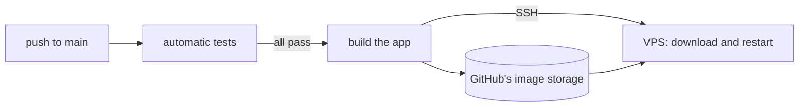

# Deploy to a VPS

This guide puts the app on your own server. When you finish:

- The app runs at an address like `https://app.example.com`.
- Every change you push to the `main` branch goes live by itself, after the automatic tests pass.

For the Google Cloud option instead, see [architecture.md › GCP target](architecture.md#gcp-target).

## Words used in this guide

| Word | Meaning |
| --- | --- |
| **VPS** | Your rented Linux server. The app runs there. |
| **Your machine** | Your own laptop, with a copy of this repo on it. |
| **Firebase** | A Google service. It stores the app's data and checks logins. Its free plan is enough. |
| **Agency login** | An email and password that can sign in to the app. You create each one by hand. Nobody can sign up on their own. |
| **Deploy** | Putting a new version of the app on the VPS. |

Every command in this guide says where it runs: **on your machine** or **on the VPS**. To run a command on the VPS, connect to it first with `ssh <user>@<vps>`. If your server uses another SSH port, add it: `ssh -p 2222 <user>@<vps>`.

## What you need

- **A VPS** with Ubuntu or Debian and at least 1 GB of memory. Use 2 GB if WordPress runs on the same server.
- **A domain name** whose DNS settings you can change.
- **A Google account**, for Firebase.
- **On your machine:** this repo, and the GitHub command-line tool (`gh`). Log in to it once with `gh auth login`. Your GitHub account needs admin rights on the repo.

## The steps at a glance

1. Set up Firebase: the database, your login, and two keys.
2. Prepare the VPS: install Docker, nginx and certbot.
3. Point two web addresses at the VPS.
4. Run the setup script. It does the rest of the server work for you.
5. Back up the app's secret key.
6. Deploy for the first time.
7. Check that everything works.

Plan about 45 minutes the first time.

## Step 1: Set up Firebase

All of this step happens in your web browser, at [console.firebase.google.com](https://console.firebase.google.com).

### Create or open the project

1. Click **Add project**.
2. Pick an existing Google Cloud project, or type a name for a new one.
3. Turn off Google Analytics. The app doesn't use it.
4. Stay on the free **Spark** plan. The bottom of the left sidebar shows the current plan.

### Create the database

1. In the left sidebar, open **Databases & Storage → Firestore**. In older versions of the console, it's **Build → Firestore Database**.
2. Click **Create database**.
3. Choose **production mode**.
4. Pick a location close to your VPS. **You can't change the location later.**
5. Wait until the page shows an empty database called `(default)`.

The database stays empty for now. That's correct: the app adds its own data when you start using it.

### Turn on email-and-password login

This part only switches the login feature on. **You don't create any login yet.** That's the next part.

1. In the left sidebar, open **Security → Authentication**. You can also type "Authentication" in the search box at the top of the sidebar.
2. If you see a **Get started** button, click it.
3. Open the **Sign-in method** tab.
4. Click **Email/Password**.
5. Turn on the first switch, the one labeled **Email/Password**. Leave the second switch (**Email link**) off.
6. Click **Save**.

### Create your login

Here you create the email and password you'll use to sign in to the app.

1. Stay in **Authentication** and open the **Users** tab.
2. Click **Add user**.
3. Type an email address. Use any address you own, for example `you@example.com`.
4. Type a password of at least 12 characters.
5. Click **Add user**.
6. **Write the email down.** In step 4, you give it to the setup script as `AGENCY_EMAILS`.

Firebase doesn't send anything to this email. To add a login for a colleague, repeat this part and send them the password privately.

### Allow your app's web address

1. Stay in **Authentication** and open the **Settings** tab.
2. Click **Authorized domains**, then **Add domain**.
3. Type your app's address without `https://`, for example `app.example.com`.
4. Click **Add**.

Add only the app's address. The API's address doesn't go here.

If the **Settings** tab also has **User actions → Enable create (sign-up)**, turn it off. If you don't see that option, that's fine. The app blocks strangers anyway.

### Get the web key

1. Click the gear icon in the left sidebar, then **Project settings**.
2. In the **General** tab, scroll down to **Your apps**.
3. Click the **Web** icon (`</>`).
4. Type any name, for example `web`. Leave Firebase Hosting off.
5. Click **Register app**.
6. Firebase shows a block of code. Find the line `apiKey: "AIza..."`. **Copy the value between the quotes.** In step 4, you give it to the setup script as `FIREBASE_API_KEY`.

This key is not a secret. It only tells the app which Firebase project to use.

### Download the server key

1. In **Project settings**, open the **Service accounts** tab.
2. Ignore the code example and its Node.js / Java / Python / Go choice. It only changes the example, not the key.
3. Click **Generate new private key**, then **Generate key**.
4. A `.json` file downloads to your machine. **Note where it is.** In step 4, you give its path to the setup script as `FIREBASE_KEY`.

**This file is a secret.** Anyone who has it can read and change all of the app's data. Don't email it, and don't commit it to git.

## Step 2: Prepare the VPS

Run these commands **on the VPS**. If something is already installed, for example because WordPress runs there, skip that command.

Install Docker:

```bash
curl -fsSL https://get.docker.com | sudo sh
```

Install nginx and certbot. nginx sends visitors to the app. certbot gets the free HTTPS certificates:

```bash
sudo apt-get update && sudo apt-get install -y nginx certbot python3-certbot-nginx
```

Open only the ports for SSH, web and secure web. `OpenSSH` means port 22. If your server uses another SSH port, for example 2222, use `sudo ufw allow 2222/tcp` instead. **Allow your SSH port before `ufw enable`, or you lock yourself out.**

```bash
sudo ufw allow OpenSSH && sudo ufw allow 'Nginx Full' && sudo ufw enable
```

If your hosting company has its own firewall or "security group" page, open your SSH port, 80 and 443 there too.

Let your user run Docker without `sudo`. The automatic deploy needs this:

```bash
sudo usermod -aG docker $USER
```

Log out of the VPS and log back in. Then check that this command works without `sudo`:

```bash
docker ps
```

If the VPS has less than 2 GB of memory, add 2 GB of swap. Swap is disk space the server uses when memory runs out:

```bash
sudo fallocate -l 2G /swapfile && sudo chmod 600 /swapfile && sudo mkswap /swapfile && sudo swapon /swapfile && echo '/swapfile none swap sw 0 0' | sudo tee -a /etc/fstab
```

## Step 3: Point two web addresses at the VPS

The app uses two web addresses:

- **The app address**, for example `app.example.com`. This is where you and your clients open the app.
- **The API address**, for example `api.example.com`. This shows the API's documentation page. You rarely need it.

You can choose any names, for example `importer-app.example.com` and `importer-api.example.com`.

At the company that manages your domain's DNS, add two **A records**. Both point at your VPS's public IP address:

| Name | Type | Value |
| --- | --- | --- |
| `app` (or your chosen name) | A | Your VPS's IP address |
| `api` (or your chosen name) | A | Your VPS's IP address |

**If you use Cloudflare, set both records to "DNS only" (the grey cloud), not "Proxied".** With the proxy on, two things break:

- The automatic deploy can't connect to the VPS.
- The app can't see each visitor's real address, which it needs to block abuse.

Ignore Cloudflare's banner that says proxying is required. Also ignore its suggestions about `www` and the main domain.

**On your machine**, check both addresses. Each command prints the VPS's IP address when the record works:

```bash
dig +short app.example.com
```

```bash
dig +short api.example.com
```

New records can take a few minutes to work. Wait until both commands print the IP address before you continue.

## Step 4: Run the setup script

The setup script does the rest of the server work. You run one command **on your machine**, from the repo's main folder.

### Collect the values

The script asks for seven values. You already have all of them:

| Value | What to put | Where it comes from |
| --- | --- | --- |
| `APP_DOMAIN` | The app address, for example `app.example.com` | Step 3 |
| `API_DOMAIN` | The API address, for example `api.example.com` | Step 3 |
| `VPS` | Your VPS user and address, for example `ubuntu@203.0.113.10` | How you log in with `ssh`. In `ssh -p 2222 ubuntu@203.0.113.10`, it's `ubuntu@203.0.113.10`. |
| `VPS_PORT` | The SSH port. Press `Enter` for the usual port 22. | The number after `-p` in your `ssh` command, for example `2222`. No `-p` means 22. |
| `FIREBASE_KEY` | The path to the downloaded `.json` file | Step 1, "Download the server key" |
| `FIREBASE_API_KEY` | The `apiKey` value, which starts with `AIza` | Step 1, "Get the web key" |
| `AGENCY_EMAILS` | The email of your login | Step 1, "Create your login" |

`AGENCY_EMAILS` is not something you create anywhere. It's only the list of emails that may sign in. If you made logins for several people, put all their emails in it, separated by commas, with no spaces: `you@example.com,colleague@example.com`.

### Run it

1. Open **Terminal** on your machine. On a Mac: press `Cmd + Space`, type `Terminal`, press `Enter`. Don't use a terminal that is logged in to the VPS.
2. Go to the repo folder. Change the path to yours:

   ```bash
   cd ~/projects/content-importer-adaptify
   ```

3. Start the setup:

   ```bash
   make vps-setup
   ```

4. The script asks seven questions, one at a time. Type each answer from the table above and press `Enter`. For the last question, you can drag the `.json` file from Finder into the Terminal window instead of typing its path.

The script then prints a line starting with `==>` for each thing it does. It might ask for your VPS password once, when it needs `sudo`. It's finished when it prints `==> Done`.

If it stops with an error, nothing is half-done in a way that matters. Fix the cause and run `make vps-setup` again.

### What the script does

You don't need to do any of this yourself. The list is here so you know what changed on your server:

- Checks that both web addresses point at the VPS.
- Creates a key that lets GitHub log in to your VPS for deploys. The key is saved on your machine at `~/.ssh/content-importer-deploy`.
- Creates a private folder `~/app` on the VPS and copies the Firebase server key into it.
- Creates the app's settings file `~/app/.env`, with your `AGENCY_EMAILS` and new random passwords. If the file already exists, the script leaves it alone.
- Sets up nginx for both web addresses and gets free HTTPS certificates. This accepts the Let's Encrypt terms of service for you.
- Saves seven settings in your GitHub repo, so the automatic deploy knows how to reach the VPS, including its SSH port.

You can run the script again at any time. It only fills in what's missing.

## Step 5: Back up the secret key

The settings file holds one value you must never lose: `CREDENTIAL_ENCRYPTION_KEY`. The app uses it to lock away WordPress passwords and review links. If you lose it, you have to add every WordPress site again.

**On the VPS**, show it:

```bash
grep CREDENTIAL_ENCRYPTION_KEY ~/app/.env
```

Copy the whole line into your password manager.

Then, **on your machine**, delete the downloaded Firebase file. The VPS has its own copy now:

```bash
rm ~/Downloads/my-project-firebase-adminsdk-abc12.json
```

## Step 6: Deploy for the first time

Any push to the `main` branch starts a deploy. If you have nothing new to push, run the latest one again **on your machine**:

```bash
gh run rerun $(gh run list --workflow ci.yml --branch main --limit 1 --json databaseId -q '.[0].databaseId')
```

Watch it. The tests take a few minutes. Then the deploy builds the app and starts it on the VPS:

```bash
gh run watch
```

## Step 7: Check that it works

**On the VPS**, check that both parts of the app run. Both lines say `running`:

```bash
cd ~/app && docker compose ps
```

**On your machine**, check the API. It answers `{"status":"ok"}`:

```bash
curl -s https://api.example.com/health
```

Then, in your web browser:

1. Open your app address, for example `https://app.example.com`.
2. Sign in with the email and password from step 1.
3. Open **Sites → Add site**. Enter your WordPress address, a WordPress user name and that user's application password. You create an application password in WordPress under **Users → Profile → Application Passwords**.
4. Try the full flow: import an article, send it for review, approve it, schedule it at least 6 minutes ahead, and wait until it shows Published.

Finally, check the server's memory **on the VPS**:

```bash
free -h
```

If the `available` column shows less than about 200 MB, add swap (step 2) or move to a bigger server.

## After setup

### Put a new version live

Push to the `main` branch. That's all. The tests run first, and only a version that passes them goes live. Pull requests never go live.

To watch it happen, run `gh run watch` on your machine.

### Add a login for someone

1. Create their login in Firebase: **Authentication → Users → Add user** (see "Create your login" in step 1).
2. **On the VPS**, open the settings file:

   ```bash
   nano ~/app/.env
   ```

3. Find the line that starts with `AGENCY_EMAILS=`. Add a comma and their email at the end, with no spaces. For example: `AGENCY_EMAILS=you@example.com,colleague@example.com`.
4. Save the file: press `Ctrl+O`, `Enter`, then `Ctrl+X`.
5. Restart the API so it reads the change:

   ```bash
   cd ~/app && docker compose up -d api
   ```

Running the setup script again does **not** change `AGENCY_EMAILS`. Always edit the file instead.

### Remove someone's login

1. In Firebase, open **Authentication → Users**. Click the **⋮** menu next to the person, then **Disable account** or **Delete account**. They're signed out the next time they open a page.
2. Remove their email from `AGENCY_EMAILS` and restart the API, as in "Add a login for someone".

Do both. If you only remove the email, a person who is already signed in stays signed in for up to 5 days.

### Change a password

In Firebase, open **Authentication → Users**. Click the **⋮** menu next to the person, then **Reset password**. Firebase emails them a link to choose a new password.

### See the logs

**On the VPS**:

```bash
cd ~/app && docker compose logs -f api web
```

Press `Ctrl+C` to stop.

### Go back to an older version

**On the VPS**, with the commit you want from GitHub's history:

```bash
cd ~/app && IMAGE_TAG=<commit sha> docker compose up -d
```

The next push to `main` puts the newest version back. Versions older than a week are removed from the server. Getting one of those back needs `docker login ghcr.io` first, with a GitHub token that has the `read:packages` permission.

### HTTPS certificates

They renew by themselves. certbot checks them twice a day.

### Local development

On your machine, the app uses a fake Firebase called the emulator, not the real project. `make agency-user` creates the local login. It uses `AGENCY_EMAIL` and `AGENCY_PASSWORD` from the repo's `.env` file.

## When something goes wrong

| What you see | Why | What to do |
| --- | --- | --- |
| Setup script: `doesn't resolve yet` | The web addresses don't point at the VPS yet | Wait a few minutes. Check again with `dig` (step 3). |
| Setup script: `HTTP 404: Not Found` when setting a variable | `gh` is logged in to a GitHub account that can't see the repo | Run `gh auth login` with the account that owns the repo, check with `gh auth status`, then run the script again. |
| Setup script: certbot fails | Ports 80 and 443 are closed, or an address points at the wrong server | Check the firewall (step 2) and the DNS records (step 3). |
| Deploy: `Permission denied (publickey)` | GitHub's key isn't allowed on the VPS, or `VPS` has the wrong user | Run the setup script again. |
| Deploy: `Host key verification failed` | The VPS changed, for example it was rebuilt | Run the setup script again. |
| Setup or deploy: `Connection refused` or `timed out` on SSH | Wrong SSH port, or the firewall blocks it | Check the port you use with `ssh -p`, and run the setup script again with that port. |
| Deploy: `permission denied ... docker.sock` | Your VPS user can't run Docker | Do the `usermod` command in step 2, then log out and back in. |
| Deploy: `denied` from `ghcr.io` | GitHub refused to share the app's images | Open the package's settings on GitHub and check that this repo has access. |
| The API keeps restarting | A setting is missing | On the VPS: `cd ~/app && docker compose logs api`. Check `~/app/.env` and the Firebase key file. |
| Login: "unauthorized domain" | The app address isn't allowed in Firebase | Do "Allow your app's web address" in step 1. |
| Login fails, or says "Please sign in again" | The email isn't in `AGENCY_EMAILS`, or it's spelled differently | Fix the line in `~/app/.env` (see "Add a login for someone"). |
| Upload fails with error 413 | The file is bigger than 30 MB | Use smaller files. |
| Saved WordPress sites show as unreachable | `CREDENTIAL_ENCRYPTION_KEY` changed | Put back the key you saved in step 5. |

## Doing the setup by hand

The setup script does all of this for you. Use this part only to understand the script or to redo one piece.

**The settings file (on the VPS):**

```bash
mkdir -m 700 ~/app && cd ~/app && umask 077 && nano .env
```

Put this in it, with your own values:

```
WEB_BASE_URL=https://app.example.com
# Make one with: openssl rand -base64 32 | tr '+/' '-_'
CREDENTIAL_ENCRYPTION_KEY=
# Make one with: openssl rand -base64 32
INTERNAL_API_SECRET=
AGENCY_EMAILS=you@example.com
```

**The Firebase server key (on your machine):**

```bash
scp -P <port> ~/Downloads/my-project-firebase-adminsdk-abc12.json <user>@<vps>:app/firebase-service-account.json
```

```bash
ssh -p <port> <user>@<vps> chmod 644 app/firebase-service-account.json
```

The file can be readable by everyone because the `~/app` folder around it is private.

**nginx and HTTPS.** On your machine, copy both nginx files to the VPS with your addresses filled in. Replace `app.mydomain.com` and `api.mydomain.com` with yours:

```bash
sed 's/app\.example\.com/app.mydomain.com/' infra/app/nginx/app.conf | ssh -p <port> <user>@<vps> "cat > ~/nginx-app.conf"
```

```bash
sed 's/api\.example\.com/api.mydomain.com/' infra/app/nginx/api.conf | ssh -p <port> <user>@<vps> "cat > ~/nginx-api.conf"
```

Then, on the VPS, turn both sites on:

```bash
sudo mv ~/nginx-app.conf /etc/nginx/sites-available/app.mydomain.com && sudo ln -sf /etc/nginx/sites-available/app.mydomain.com /etc/nginx/sites-enabled/
```

```bash
sudo mv ~/nginx-api.conf /etc/nginx/sites-available/api.mydomain.com && sudo ln -sf /etc/nginx/sites-available/api.mydomain.com /etc/nginx/sites-enabled/
```

```bash
sudo nginx -t && sudo systemctl reload nginx
```

```bash
sudo certbot --nginx -d app.mydomain.com -d api.mydomain.com
```

Until the first deploy, both addresses show a "502 Bad Gateway" error. That's expected.

**The deploy key (on your machine):**

```bash
ssh-keygen -t ed25519 -f ~/.ssh/content-importer-deploy -N "" -C github-deploy
```

```bash
ssh-copy-id -p <port> -i ~/.ssh/content-importer-deploy.pub <user>@<vps>
```

**The GitHub settings (on your machine, in the repo folder):**

```bash
gh variable set VPS_SSH --body "<user>@<vps>"
```

```bash
gh variable set VPS_PORT --body "<port>"
```

```bash
gh variable set FIREBASE_API_KEY --body "AIzaSyExample"
```

```bash
gh variable set FIREBASE_AUTH_DOMAIN --body "<project-id>.firebaseapp.com"
```

```bash
gh variable set FIREBASE_PROJECT_ID --body "<project-id>"
```

```bash
gh secret set VPS_SSH_KEY < ~/.ssh/content-importer-deploy
```

```bash
ssh-keyscan -p <port> <vps> 2>/dev/null | gh secret set VPS_KNOWN_HOSTS
```

The project ID is in the Firebase key file, on the line `"project_id"`. `<port>` is your SSH port, usually 22.

## How it works

You don't need this part to set up the app. It explains what happens behind the scenes.



When you push to `main`, GitHub does this:

1. Runs the tests.
2. If they pass, builds the app into two Docker images, `api` and `web`. A Docker image is a packaged copy of a program with everything it needs to run.
3. Stores both images in GitHub's image storage (GHCR), labeled with the commit.
4. Connects to the VPS and tells it to download the new images and restart.

The VPS downloads the images with a temporary GitHub password that expires when the deploy ends. No GitHub password is stored on the server.

On the VPS, the app is two containers, started from [`infra/app/docker-compose.yml`](../infra/app/docker-compose.yml):

| Container | Reached at | Job |
| --- | --- | --- |
| `web` | The app address, through nginx | The pages you and your clients see |
| `api` | The API address, through nginx | The rules and the data. The web container talks to it directly inside Docker. |

Both containers start again by themselves after a crash or a reboot. They only accept connections from the VPS itself, so visitors always go through nginx and HTTPS.

## Why not Dokploy or Coolify

Dokploy and Coolify are free tools that give a server a web dashboard and push-to-deploy. They don't fit this setup well:

- They need ports 80 and 443 for their own traffic handling. Anything already using nginx on the server, such as WordPress, would have to move into their system.
- They use memory, and a small server has little to spare.
- The deploy here is already short: one Docker file, one GitHub job and one setup script.

**Decision:** Use them only if the server ends up hosting many apps, or if you want a web page for logs and older versions.
