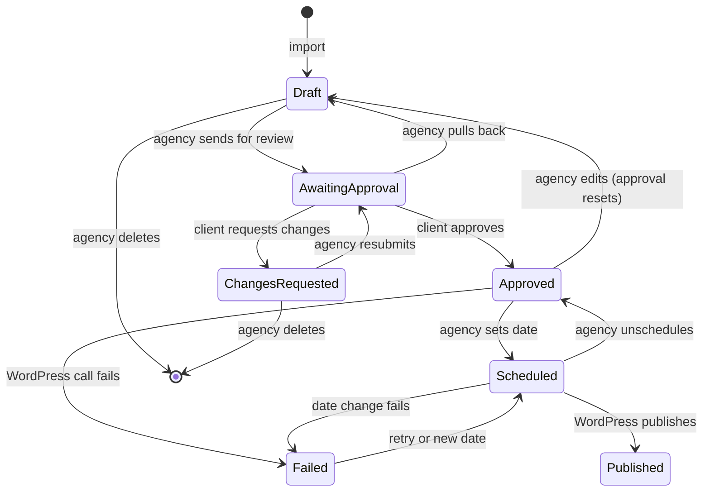

# Content Importer MVP: Feature Spec for Adaptify SEO

Oct 6, 2026 · @Arifin

## Overview

This project builds an MVP of the content importer for Adaptify SEO. The feature comes from Adaptify's public roadmap on the [About page](https://adaptify.ai/about), where it appears as:

> **Ability to import existing content** (Planned) Import articles that have been written somewhere else. Then have Adaptify SEO handle the customer approval, scheduling, publishing, and reporting.

The MVP runs as a standalone service built on Adaptify's stack.

**Business goal:** Let agencies bring articles written outside Adaptify into the customer approval, scheduling, publishing, and reporting flow.

### About Adaptify SEO

Adaptify SEO ([adaptify.ai](https://adaptify.ai)) is an AI SEO platform for marketing agencies. It grows the organic traffic of each agency's clients on autopilot: it researches keywords, builds a content plan, writes and publishes articles, audits sites, earns backlinks, and turns the results into proposals and white-labeled reports ([docs](https://adaptify.ai/docs)). White-labeled means the agency shows the reports and portal under its own brand, so the end client never sees the Adaptify name.

The company launched in 2022, took a TinySeed investment in 2023, and works across three continents. It now serves 1,000+ agencies and has published 525K+ articles and placed 25,000+ backlinks ([About page](https://adaptify.ai/about)).

### Platform modules

Each module has its own guide in the [Adaptify docs](https://adaptify.ai/docs). The descriptions below follow the docs.


| Module                | What it does                                                                                                 |
| --------------------- | ------------------------------------------------------------------------------------------------------------ |
| Content writer        | Researches, outlines, writes, reviews, and publishes SEO articles.                                           |
| Automated SEO content | Turns SEO data into an automated monthly content strategy.                                                   |
| Adaptify Agent        | Chat to edit articles, manage strategy, pull exact data, and run actions across the whole site.              |
| Keywords and Clusters | Structures keywords and clusters per website.                                                                |
| AI visibility (GEO)   | AI clusters, prompts, searches, and GEO articles. GEO means optimizing content so AI answer engines cite it. |
| Site audit            | SEO audit findings, priorities, refreshes, and customer-facing reports.                                      |
| Performance           | SEO performance reporting, CSV exports, GEO performance context, and white-label reporting views.            |
| SEO proposals         | Proposal Mode, an agency sales tool for pitching prospects.                                                  |
| My Account            | Branding, team access, WordPress plugins, and customer-facing workflows.                                     |
| Backlinks             | Backlink types and the feedback loops that improve outcomes.                                                 |
| Integrations          | Connects the client's website platform so Adaptify publishes approved articles automatically.                |


### Key terms

These terms appear throughout the spec.


| Term                 | Meaning                                                                                                         |
| -------------------- | --------------------------------------------------------------------------------------------------------------- |
| Agency / client      | The agency pays Adaptify and does the work. The client owns the website and approves the articles.              |
| Review link          | One private link per client site. The client reviews and approves articles there, without an account.           |
| Approval reset       | Any edit after approval sends the article back to Draft, so the client always approves the text that goes live. |
| Slug                 | The URL part of a post, for example `/best-running-shoes`.                                                      |
| Application password | A separate WordPress password for apps. The site owner can revoke it at any time.                               |
| Scheduled post       | A WordPress post with a future date (status `future`). WordPress publishes it on that date.                     |
| White-label          | The agency shows Adaptify's portal and reports under its own brand.                                             |


### Where the importer fits

The roadmap entry names the flow. Articles written somewhere else come into Adaptify. Adaptify then handles customer approval, scheduling, publishing, and reporting for them. Adaptify's docs already cover publishing approved articles (Integrations) and reporting (Performance).

### Tech context

Adaptify's backend uses Python, FastAPI, Firebase, GCP, LangChain, and LangSmith, and its frontend uses React and Next.js (**Confirmed**, Adaptify careers pages). This build uses the same stack, so its parts map onto Adaptify's own setup. See [architecture.md](architecture.md#tech-stack) for the full list.

### Labels used in this doc


| Label             | Meaning                                                              |
| ----------------- | -------------------------------------------------------------------- |
| **Confirmed**     | Adaptify states it in its public docs, careers pages, or About page. |
| **Assumption**    | A reasonable guess. Nobody at Adaptify has checked it.               |
| **Open question** | Unknown. Someone needs to find out.                                  |
| **Decision**      | A choice made to keep the work moving.                               |


## Scope

The MVP builds one thin slice through all five steps the roadmap entry names. Each step gets its simplest working version, because the value of the feature comes from the full flow. An importer that stops after import proves nothing.


| Roadmap step      | MVP version                                                                                           |
| ----------------- | ----------------------------------------------------------------------------------------------------- |
| Import            | Paste into an editor, or upload one or more `.docx` files. Each becomes one article.                  |
| Customer approval | One private review link per client site. The client approves or requests changes, without an account. |
| Scheduling        | The agency sets a publish date per approved article. WordPress publishes it on that date.             |
| Publishing        | One or more client WordPress sites, each through the WordPress REST API.                              |
| Reporting         | A workflow report from the app's own data: statuses, approval speed, change rounds, published URLs.   |


One AI feature sits on top, at low priority: drafting the client's requested change for the agency to review.

### Out of scope


| Item                                                                  | Reason                                                                                                    |
| --------------------------------------------------------------------- | --------------------------------------------------------------------------------------------------------- |
| Google Docs API, URL import, CMS migration                            | Each adds auth or scraping. Paste and `.docx` cover the same writers.                                     |
| Images inside documents                                               | Need upload, storage, and re-linking in WordPress. The importer warns when a document has images.         |
| SEO title and meta description                                        | Not part of core WordPress. They need an SEO plugin, and each plugin stores them its own way.             |
| Any CMS other than WordPress                                          | One publisher proves the flow.                                                                            |
| Email notifications                                                   | A separate Planned item on Adaptify's roadmap. The agency shares the review link through its own channel. |
| Search performance reports (clicks, rankings)                         | Needs Google Search Console. A test site has almost no search traffic, so the numbers would be empty.     |
| Bulk scheduling by cadence                                            | Bloat for the MVP. A date per article covers it.                                                          |
| Client accounts, team accounts, white-label branding, inline comments | Polish, not proof.                                                                                        |


## User journeys

Two people use the product. The **agency** does almost all the work. The **client** appears only to review and to see what went live, so the client's part needs no account and no learning.


| Stage                | Agency                                                             | Client                                                  |
| -------------------- | ------------------------------------------------------------------ | ------------------------------------------------------- |
| Import               | Pastes or uploads articles, cleans formatting, sets title and slug | Nothing                                                 |
| Send for review      | Marks articles ready, shares the review link                       | Gets the link                                           |
| Review               | Waits, then handles change requests                                | Reads, approves or requests changes                     |
| Schedule and publish | Sets publish dates; WordPress publishes                            | Nothing                                                 |
| Report               | Watches statuses, approval speed, live URLs                        | Sees upcoming and published articles on the review page |


### Agency journey

1. **Import.** Paste an article into the editor, or upload one or more `.docx` files. Each file becomes one article in **Draft**.
2. **Check the result.** The converted article opens in the editor. Warnings show problems the app found, for example "This document had 3 images. Images are not imported."
3. **Fix and fill in.** Clean any leftover formatting. Set the title (required) and slug (optional; WordPress makes one from the title if empty).
4. **Send for review.** Mark articles **Ready for review**. Copy the site's review link and send it to the client by email, Slack, or any channel.
5. **Handle feedback.** If the client requests changes, the comment appears on the article. The agency edits the article, or asks the AI to draft the change and reviews the draft. Then the agency sends it for review again.
6. **Schedule.** For each approved article, set a publish date and time in the articles table.
7. **Watch it go live.** The articles table shows **Published** with the live URL. A failed publish shows the reason and a **Retry** button.


### Client journey

1. **Open the link.** No login. The page shows the site name and articles grouped as: waiting for your review, upcoming, and published.
2. **Read an article.** The article appears close to its published form: title, headings, lists, links.
3. **Decide.** Click **Approve**, or click **Request changes** and write a comment. The client types their name once, so the agency knows who decided.
4. **Come back later.** The same link shows what went live, with links to the live pages.


## Article lifecycle

Every article moves through seven statuses. Approval only means something if the client approved the exact text that goes live, so every edit after approval sends the article back to Draft.




| Status            | Meaning                                               | Who moves it on                                                                 |
| ----------------- | ----------------------------------------------------- | ------------------------------------------------------------------------------- |
| Draft             | Imported or being edited. Editable.                   | Agency sends for review.                                                        |
| Awaiting approval | Visible on the review page. Read-only for the agency. | Client approves or requests changes. The agency can also pull it back to Draft. |
| Changes requested | The client's comment is attached. Editable.           | Agency edits, then resubmits.                                                   |
| Approved          | The client accepted this exact text.                  | Agency sets a publish date.                                                     |
| Scheduled         | Sent to WordPress with a future date. Read-only.      | WordPress publishes it on that date. The agency can unschedule it to change it. |
| Published         | Live on the site, with a URL.                         | Final.                                                                          |
| Failed            | The WordPress call failed. The reason and the intended date are stored. | Agency clicks Retry, or sets a new date.                          |


### Approval rules

- **Locking.** An article in Awaiting approval or Scheduled is read-only. To edit it, the agency pulls it back (Awaiting approval → Draft) or unschedules it (Scheduled → Approved) first. Both wait on someone else, the client or WordPress's date, so neither can change underneath them.
- **Edits reset approval.** Editing an Approved article sends it back to Draft. Editing never calls WordPress.
- **Unschedule keeps approval.** Unscheduling moves the WordPress post to WordPress's trash first (recoverable), then the article to Approved: the text didn't change. Setting a date again creates a new post.
- **Publish time.** It must be at least 5 minutes after now. The date picker shows earlier days and times as disabled, faint text; the API refuses them too (`publish_at_in_past`), and Retry applies the same rule to its stored date.
- **Date changes keep approval.** Changing only the publish date of a Scheduled article updates WordPress and keeps the status. If WordPress refuses, the article goes Failed.
- **Publish needs approval.** The app sends an article to WordPress only after the client approved it: a first date from Approved, or a date change, retry, or new date on that same approved text.
- **Delete only before publishing.** The agency can delete an article in Draft or Changes requested, after a confirmation. The article and its history are removed for good. If it still owns a WordPress post (older data; unscheduling already trashes it), that post goes to WordPress's trash first; if WordPress refuses, nothing is deleted. Other statuses can't be deleted: an Awaiting approval article is pulled back first, and an approved article (Approved, Scheduled, Failed, Published) stays.
- **History.** Every status change adds a log entry with time and actor, for example "Approved by Sarah, Oct 8".

**Decision:** The agency sets a publish date only after approval (`schedule` accepts Approved, Scheduled and Failed). An article never reaches WordPress before the client approves it.

### Sync warnings

After an article reaches Scheduled or Published, someone can still change the post directly in WordPress. Status checks (see WordPress integration) show these cases as warnings on top of the status, without changing it:

- **Late:** still scheduled in WordPress, but the publish time has passed.
- **Changed in WordPress:** the post is now a draft or private.
- **Missing in WordPress:** the post was deleted.


## Product requirements

Requirements fall into eight epics. Priority: **P0** = MVP must have, **P1** = MVP if time allows, **P2** = after the core flow works, Backlog = recorded for later, not planned yet.

### E1. Import


| ID   | Requirement                                                                                                                                    | Priority |
| ---- | ---------------------------------------------------------------------------------------------------------------------------------------------- | -------- |
| R1.1 | Pasting into the editor and saving creates one article in Draft.                                                                               | P0       |
| R1.2 | Uploading one or more `.docx` files creates one Draft article per file.                                                                        | P0       |
| R1.3 | Conversion keeps headings, paragraphs, bulleted and numbered lists, links, bold, and italic. It strips fonts, colors, and other inline styles. | P0       |
| R1.4 | The app shows a warning when the source contains images, and drops them.                                                                       | P0       |
| R1.5 | The title comes from the first heading, else the file name. That heading is removed from the body so the title does not appear twice.          | P1       |
| R1.6 | If every heading has the same level, the app turns them into section headings under the title.                                                 | P1       |
| R1.7 | Tables in the source survive conversion.                                                                                                       | P1       |


### E2. Edit


| ID   | Requirement                                                                              | Priority |
| ---- | ---------------------------------------------------------------------------------------- | -------- |
| R2.1 | A rich-text editor edits the title, slug, and body.                                      | P0       |
| R2.2 | Editing is allowed only in Draft and Changes requested. Awaiting approval and Scheduled are read-only. | P0       |
| R2.3 | Editing an Approved article moves it back to Draft (see Article lifecycle).               | P0       |
| R2.4 | Each article keeps a history log of status changes with time and actor.                  | P0       |
| R2.5 | The agency can delete Draft and Changes requested articles, one at a time or in bulk.    | P1       |


### E3. Review and approval


| ID   | Requirement                                                                                                                             | Priority |
| ---- | --------------------------------------------------------------------------------------------------------------------------------------- | -------- |
| R3.1 | The site has one review link with a long random token. Firestore stores a hash of the token for lookup and the token itself encrypted with the credential key, like the WordPress app password. | P0       |
| R3.2 | The agency can copy the review link from the articles screen.                                                                           | P0       |
| R3.3 | The review page lists articles in three groups: waiting for your review, upcoming, published.                                           | P0       |
| R3.4 | The client approves, or requests changes with a comment. Either action asks for the client's name once and remembers it in the browser. | P0       |
| R3.5 | The client's comment appears on the article for the agency.                                                                             | P0       |
| R3.6 | The agency can pull an Awaiting approval article back to Draft.                                                                         | P1       |
| R3.7 | The agency can reset the review link, which turns off the old one.                                                                      | P1       |


### E4. Schedule and publish


| ID   | Requirement                                                                                  | Priority |
| ---- | -------------------------------------------------------------------------------------------- | -------- |
| R4.1 | The articles table has a publish date and time field for each Approved article. The time must be at least 5 minutes ahead. | P0       |
| R4.2 | Setting the date sends the post to WordPress as scheduled, with title, slug, body, and date. | P0       |
| R4.3 | Unscheduling a Scheduled article moves its WordPress post to trash and keeps approval. | P0       |
| R4.4 | A failed WordPress call sets Failed, stores the reason, and offers Retry.                    | P0       |
| R4.5 | Changing only the date of a Scheduled article updates WordPress and keeps the status.        | P1       |


### E5. Status sync


| ID   | Requirement                                                                                           | Priority |
| ---- | ----------------------------------------------------------------------------------------------------- | -------- |
| R5.1 | Opening the articles table or the review page checks all Scheduled articles in one WordPress request. | P0       |
| R5.2 | The app maps WordPress statuses to its own, including the three sync warnings.                        | P0       |
| R5.3 | A failed check changes nothing and shows a "Can't reach WordPress" banner on the agency screens. Client pages hide it (see Client view). | P0       |
| R5.4 | Check results are cached for one minute, per site.                                                    | P1       |


### E6. Reporting


| ID   | Requirement                                                                                         | Priority |
| ---- | --------------------------------------------------------------------------------------------------- | -------- |
| R6.1 | The agency report shows counts per status and articles published this month.                        | P0       |
| R6.2 | The agency report lists published articles with date and live URL, and upcoming articles with date. | P0       |
| R6.3 | The agency report shows average time from sent for review to approved.                              | P1       |
| R6.4 | The agency report shows change rounds per article.                                                  | P1       |
| R6.5 | The review page shows the client's view: waiting, upcoming, published.                              | P0       |


### E7. AI change drafting


| ID   | Requirement                                                                                                        | Priority |
| ---- | ------------------------------------------------------------------------------------------------------------------ | -------- |
| R7.1 | A Changes requested article has a "Draft this change" button.                                                      | P2       |
| R7.2 | The draft appears next to the current text with the differences marked. The agency accepts, edits, or discards it. | P2       |
| R7.3 | AI spend stops at the monthly limit (see [Cost and limits](architecture.md#cost-and-limits)).                                                     | P2       |
| R7.4 | On a Draft or Changes requested article, the agency types its own instruction and gets an AI draft of the edit.    | Backlog  |
| R7.5 | One instruction applies to several selected articles. Each article gets its own draft.                             | Backlog  |


### E8. Access


| ID   | Requirement                                                               | Priority |
| ---- | ------------------------------------------------------------------------- | -------- |
| R8.1 | The agency app needs a login once deployed. Accounts are created by the admin in the Firebase console, and only emails listed in `AGENCY_EMAILS` can sign in. The live app's login screen shows the public demo login (`agency@example.com` / `pass@123`). | P0       |
| R8.2 | The review page works without a login, through its token only.            | P0       |


## Screens

The agency app has five screens, all scoped to one client site except Sites. The client sees one separate page. A public landing page at `/` explains the product to agency owners. The articles table carries most of the daily work: status, scheduling, and the review link all live there.


| Screen         | Who    | What it shows                                                                                                                                                                  | Requirements |
| -------------- | ------ | ------------------------------------------------------------------------------------------------------------------------------------------------------------------------------ | ------------ |
| Landing        | Public | At `/` when signed out: what the product does, how the four steps work (import, client approval, schedule, publish and report), features, FAQ, and links to the demo login. Signed-in visitors go to `/app`. | R8.1         |
| Sites          | Agency | Every client site with its WordPress connection status, article count and needs-attention count; the last opened site has a "Current" badge. "Add site" opens a dialog that tests the WordPress connection before saving. A collapsed "How do I get a username and application password?" section in it explains how to create an Author user and its application password, and that the password only works with that user's username. Each row has Edit and Delete; delete removes the site's articles too and asks for the site name. | E8           |
| Import         | Agency | Paste tab with a title field and the editor, Upload tab with a `.docx` drop zone for one or more files, per-file results with Delete, and a link to the articles list.                                                                        | E1           |
| Articles       | Agency | One row per article: title (with the WordPress error under a Failed one), status, sync warning, publish date, live URL. "Set date" on Approved rows, "Change date" on Scheduled, "Retry" on Failed; a "More actions" menu with Open, View live, Copy live link and Delete. Checkboxes on deletable rows for bulk delete. "Copy review link" at the top, with "Reset review link" beside it. Search and status filter. | E3, E4, E5   |
| Article detail | Agency | Editor for title, slug, body. Client feedback and activity log on the side; each change request in the log opens to show its comment. The primary action follows the status: send, resubmit, pull back, set date, unschedule and change date, retry or set a new date, view live. Delete for Draft and Changes requested.  | E2, E3, E7   |
| Report         | Agency | Cards for published this month, time to approval and change rounds; articles by status; needs attention, upcoming, change rounds per article, and published lists.           | E6           |
| Review page    | Client | Site name, articles grouped as waiting (with the date sent), upcoming, published. Article reader with Approve and Request changes; after a decision the client returns to the list. | E3, E6       |

- **Last opened site.** `/app` opens the site the agency last worked in (a cookie), or the first site. Sign-in lands there.
- **Site switcher.** Every agency screen has a site switcher at the top of the sidebar: search, one row per site with a red dot when its WordPress connection failed, then "All sites" and "Add site". "All sites" is also pinned at the bottom of the sidebar.
- **Status filter.** A select at every width: "All", each status with its count, and "Needs attention" (Failed or any sync warning).
- **Fresh data.** Articles, Article detail and the client's review pages refetch when the tab regains focus (at most every 5 seconds), and have a Refresh button, so the other side's changes show without a reload. Article detail skips both while there are unsaved changes.
- **Editing after approval.** On an Approved article, "Edit" first asks for confirmation: editing resets the client's approval. A Scheduled article has no Edit; it says to unschedule first.

**Decision:** The review page is a separate, simple route with no agency navigation. It works on a phone, since clients often open links from email on mobile.

- **Desktop review** is one 3-column page: article list, reader, decision panel. Below `lg` the list and the reader are separate screens.
- **Request changes** is an inline form: on mobile the sticky bottom bar grows into it over a light blur that keeps the article readable and scrollable; on desktop it replaces the decision panel.
- **Client name** is an inline field in the decision panel, remembered on the device.

## Reporting

The MVP builds a **workflow report** from the app's own data plus status checks. It answers where every article stands, how fast clients approve, and what went live. Search performance reporting (clicks, rankings) stays out of scope.

### Agency report


| Block           | Content                                                                                | Source                   |
| --------------- | -------------------------------------------------------------------------------------- | ------------------------ |
| Status counts   | Draft, Awaiting approval, Changes requested, Approved, Scheduled, Published this month | Article statuses         |
| Approval speed  | Average time from first sent for review to approved                                    | History log              |
| Change rounds   | Articles that needed changes, and rounds per article                                   | History log              |
| Upcoming        | Scheduled articles with publish dates                                                  | Articles + status sync   |
| Published       | Title, publish date, live URL                                                          | Articles + status sync   |
| Needs attention | Failed, Late, Changed in WordPress, Missing in WordPress                               | Statuses + sync warnings |


### Client view

The review page doubles as the client's report. It shows only what the client cares about: articles waiting for their review, upcoming articles with dates, and published articles with live links. Drafts, internal statuses, and agency numbers stay hidden.

## WordPress integration

The app talks to WordPress only through its REST API, never through its database. In real use WordPress is the client's own site, so the MVP keeps the same boundary. Unapproved drafts never reach WordPress.

### Authentication

The app logs in with a WordPress **application password**: a separate password WordPress creates for apps, which the site owner can revoke at any time. It goes in an HTTP Basic auth header. WordPress turns off application passwords on sites without HTTPS, unless the site is marked as a local environment. The local Docker site sets `WP_ENVIRONMENT_TYPE=local`; the VPS site runs behind HTTPS.

When a site is added, edited, or tested, the app calls `GET /wp-json/wp/v2/users/me?context=edit` with its credentials. A failure refuses the save with `wp_connection_failed`; the last result is stored on the site as `connection_ok` and `connection_checked_at`.

### Calls


| When                                    | Call                             | Body                                                              |
| --------------------------------------- | -------------------------------- | ----------------------------------------------------------------- |
| Agency sets a date (first time)         | `POST /wp-json/wp/v2/posts`      | `title`, `content` (HTML), `slug`, `status: "future"`, `date_gmt` |
| Agency changes only the date            | `POST /wp-json/wp/v2/posts/{id}` | `date_gmt`                                                        |
| Agency unschedules an article           | `DELETE /wp-json/wp/v2/posts/{id}` | none: WordPress moves the post to its trash (a 404 counts as done) |
| Article is approved and scheduled again | `POST /wp-json/wp/v2/posts/{id}` | new `title`, `content`, `slug`, `status: "future"`, `date_gmt`    |
| Agency deletes a Draft that owns a post | `DELETE /wp-json/wp/v2/posts/{id}` | none: WordPress moves the post to its trash                     |
| Status check                            | `GET /wp-json/wp/v2/posts`       | query below                                                       |


The app stores the WordPress post ID after the first create and reuses it for every later change. One article never creates two posts.

**Dates.** The agency picks a date and time in its own timezone. The app converts it to GMT and sends `date_gmt`, so the WordPress site's timezone setting doesn't matter.

**Timeouts.** If a create call times out, the app can't know whether WordPress made the post. On retry, it first looks for a post with the same slug (`GET /posts?slug=…&status=future,draft,publish,private&context=edit`) and reuses it when found.

### Status check

One request covers all Scheduled articles, plus Published ones not checked in the last day (in chunks of 100, WordPress's page limit):

```
GET /wp-json/wp/v2/posts?include=12,15,18&status=publish,future,draft,private&_fields=id,status,link,date_gmt&context=edit&per_page=100
```

- `include` limits the result to our posts.
- `status` lists every state we need. Without it, WordPress returns only published posts.
- `_fields` trims the reply to four fields.
- `context=edit` with the application password shows posts that are not public yet.


| WordPress returns           | Result in the app                                  |
| --------------------------- | -------------------------------------------------- |
| `future`, date still ahead  | Stays Scheduled                                    |
| `publish`                   | Published, with the live URL from `link`           |
| `future`, date passed       | Scheduled + Late warning                           |
| `draft` or `private`        | Keeps status + Changed in WordPress warning        |
| Post missing from the reply | Keeps status + Missing in WordPress warning        |
| Request fails               | No change, plus the "Can't reach WordPress" banner |


**Decision:** Check only on page load, with no background job. Published articles get rechecked at most once a day, since only a deletion can change them.

## AI: drafting the requested change

Change requests are the slowest part of the approval loop. When a client writes "make the intro shorter and mention our free trial", the agency usually rewrites by hand. This feature drafts that edit, and the agency reviews it before anything reaches the client. It is P2: built after the core flow works.

### Flow

1. The agency opens a Changes requested article and clicks **Draft this change**.
2. The API sends the article body and the client's comment to the LLM.
3. The LLM returns three things: the revised article, a one-line summary of what changed, and any part of the request it could not do.
4. The app shows the draft next to the current text, with differences marked.
5. The agency accepts, edits, or discards the draft. Accepting only updates the body. The agency still resubmits, so the client approves the final text.


### Implementation


| Part          | Choice                                                                                          |
| ------------- | ----------------------------------------------------------------------------------------------- |
| Model         | Gemini Flash-Lite on Vertex AI                                                                  |
| Framework     | LangChain structured output into a Pydantic model: `revised_html`, `change_summary`, `not_done` |
| Tracing       | LangSmith, one trace per draft                                                                  |
| Output safety | The revised HTML is cleaned to the same allowed tags as imported content                        |
| Prompt rule   | Change only what the comment asks for. Keep everything else word for word.                      |


### Cost

An article of about 2,500 tokens in and 2,500 tokens out costs under one cent per draft at Flash-Lite prices ($0.25 input, $1.50 output per million tokens, from the [Vertex AI pricing page](https://cloud.google.com/vertex-ai/generative-ai/pricing), checked Oct 2026).

### Quality check

Keep a small set of about 15 real-style change requests with their articles in a LangSmith dataset. After each prompt change, rerun them and review the drafts by hand. Look for two failures: requests left undone, and text changed that the client never asked about.

### Backlog: edit by prompt

The agency types its own instruction, for example "add a short FAQ at the end" or "make the tone more casual", and the AI drafts the edit. This mirrors the Adaptify Agent, which lets agencies chat to edit articles (**Confirmed**, Adaptify docs). It is a backlog item: recorded, not planned yet.

- **Same flow as change drafting.** Same draft, diff view, accept, edit, or discard, and the same `SpendGuard` limit.
- **Same endpoint.** `POST /articles/{id}/ai-drafts` takes an optional `instruction`. Without it, the draft follows the client's comment.
- **Approval stays intact.** It works only in Draft and Changes requested. An accepted draft still needs client approval before publishing.
- **Several articles at once (R7.5).** A later extension, for example "mention our new pricing in all selected articles". Each article gets its own draft and its own approval.


## Data model

The app keeps its own data in Firestore, separate from WordPress's database. Firestore holds everything WordPress doesn't know about: drafts, approvals, comments, history, and the review token. WordPress holds only the posts the app sends it.

```
sites/{siteId}
  articles/{articleId}
    events/{eventId}
    ai_drafts/{draftId}
ai_usage/{yyyy-mm}
```


| Collection  | Key fields                                                                                                                                                                                                                 | Notes                                                                                                                                                                                                                             |
| ----------- | -------------------------------------------------------------------------------------------------------------------------------------------------------------------------------------------------------------------------- | --------------------------------------------------------------------------------------------------------------------------------------------------------------------------------------------------------------------------------- |
| `sites`     | name, wp_base_url, wp_username, wp_app_password_encrypted, review_token_hash, review_token_encrypted, review_token_created_at, connection_ok, connection_checked_at                                                                                                                      | One document per agency-managed client site, created through `POST /sites`. The WordPress app password and the review token are encrypted at rest (a symmetric key from config/Secret Manager); the plaintext review token never touches Firestore (see the Decision below).                                                                                        |
| `articles`  | title, slug, body_html, source (paste or docx), source_filename, warnings, status, sync_warning, version, approved_version, publish_at_utc, wp_post_id, published_url, last_error, last_checked_at, client_comment, sent_for_review_at, created_at, updated_at | `version` goes up on every edit (title, slug, or body). `approved_version` records which version the client approved; cleared when an edit resets approval. `client_comment` holds the client's latest change request; cleared when the agency edits or resubmits, or the client approves. `sent_for_review_at` is the last send, shown to the client. |
| `events`    | type, actor, at, data                                                                                                                                                                                                      | The history log. Types: imported, edited, sent_for_review, pulled_back, approved, changes_requested, scheduled, date_changed, unscheduled, published, failed, retried, ai_draft_created, ai_draft_accepted. `data` holds the comment, the error, or `reset_from` on an edit that reset approval. |
| `ai_drafts` | revised_html, change_summary, not_done, status (open, accepted, discarded), cost_usd, created_at                                                                                                                           | P2.                                                                                                                                                                                                                               |
| `ai_usage`  | spent_usd                                                                                                                                                                                                                  | P2. One document per month for the spend limit.                                                                                                                                                                                   |


**Decision:** The report is computed on request from `articles` and `events`, not stored. An MVP site has at most a few hundred articles, so this stays fast and never goes stale.

**Decision:** A leaked database export must not open a review page. Firestore keeps a SHA-256 hash of the review token, used to look up and verify incoming client requests, and the token itself encrypted with `CREDENTIAL_ENCRYPTION_KEY` (the same Fernet key as the WordPress app password), so the agency can copy the same link again on any instance and after restarts. The key lives outside Firestore (`.env` locally, Secret Manager on GCP), so the export alone is not enough. If the key changes, the stored token no longer decrypts and the next `GET /sites/{id}/review-link` rotates it; old client links then stop working (T-040).

## API endpoints

Agency routes need a Firebase **session cookie**: the web app exchanges the Firebase ID token for one at `POST /auth/session`, and `auth.py` checks it with `verify_session_cookie` (see [architecture.md](architecture.md#auth)). Client routes need only the review token in the path. Endpoints that show statuses run the WordPress status check first.

Every error body is `{"code": "..."}`; `wordpress_error` and `wp_connection_failed` add a `message` with WordPress's reason. A request that fails schema validation (for example a slug with capitals, or a comment over 2,000 characters) returns `422 {"code": "validation_error", "fields": ["body.slug"]}`.

### Agency


| Method | Path                                                     | Purpose                                                           |
| ------ | --------------------------------------------------------- | ----------------------------------------------------------------- |
| GET    | `/health`                                                | Liveness check, no session needed.                                |
| POST   | `/auth/session`                                          | Exchange a Firebase ID token for a session cookie.                |
| POST   | `/sites`                                                 | Create a client site: tests the WordPress connection, stores the app password encrypted, and mints its review token. The URL must be `https://` (`422 insecure_url`); `http://` is accepted only in local development. |
| GET    | `/sites`                                                 | List the agency's client sites, each with its last connection result, article count and needs-attention count (Failed or a sync warning). |
| POST   | `/sites/test-connection`                                 | Test new WordPress details without saving anything.               |
| POST   | `/sites/{siteId}/test-connection`                        | Test the stored details, with any given fields overriding them. Testing exactly what is stored records the result on the site. |
| PATCH  | `/sites/{siteId}`                                        | Edit name or WordPress details; changed details are tested first. |
| DELETE | `/sites/{siteId}`                                        | Delete the site with its articles and review link. WordPress is not touched. |
| POST   | `/sites/{siteId}/articles/paste`                         | Create a Draft from pasted HTML.                                  |
| POST   | `/sites/{siteId}/articles/upload`                        | Create one Draft per uploaded `.docx` file.                       |
| GET    | `/sites/{siteId}/articles`                               | List articles, filter by status. Runs the status check.           |
| GET    | `/sites/{siteId}/articles/{id}`                          | Article with comment and history.                                 |
| PATCH  | `/sites/{siteId}/articles/{id}`                          | Edit title, slug, body. Applies the approval reset rule.          |
| DELETE | `/sites/{siteId}/articles/{id}`                          | Delete a Draft or Changes requested article and its history.      |
| POST   | `/sites/{siteId}/articles/{id}/send-for-review`          | Draft or Changes requested to Awaiting approval.                  |
| POST   | `/sites/{siteId}/articles/{id}/pull-back`                | Awaiting approval to Draft.                                       |
| POST   | `/sites/{siteId}/articles/{id}/schedule`                 | Set or change the publish time. Body: `publish_at` with timezone. |
| POST   | `/sites/{siteId}/articles/{id}/unschedule`               | Scheduled to Approved; the WordPress post goes to trash.          |
| POST   | `/sites/{siteId}/articles/{id}/retry`                    | Retry a Failed WordPress call on its stored date (`publish_at_in_past` once that has passed). |
| GET    | `/sites/{siteId}/review-link`                            | The current review URL.                                           |
| POST   | `/sites/{siteId}/review-link/reset`                      | New token; the old link stops working.                            |
| GET    | `/sites/{siteId}/report`                                 | Agency report. Runs the status check.                             |
| POST   | `/sites/{siteId}/articles/{id}/ai-drafts`                | P2. Draft the requested change.                                   |
| POST   | `/sites/{siteId}/articles/{id}/ai-drafts/{draftId}/accept`  | P2. Replace the body with the draft.                            |
| POST   | `/sites/{siteId}/articles/{id}/ai-drafts/{draftId}/discard` | P2.                                                              |


### Client


| Method | Path                                            | Purpose                                                                                |
| ------ | ----------------------------------------------- | -------------------------------------------------------------------------------------- |
| GET    | `/review/{token}`                               | Site name and articles grouped as waiting, upcoming, published. Runs the status check. |
| GET    | `/review/{token}/articles/{id}`                 | One article for reading, with its `version`. Only articles visible to the client.      |
| POST   | `/review/{token}/articles/{id}/approve`         | Body: `client_name`, `version`.                                                        |
| POST   | `/review/{token}/articles/{id}/request-changes` | Body: `client_name`, `comment`, `version`.                                             |

Client routes carry no `siteId` — the API resolves which site a token belongs to from the token's hash, not from the path.

**Decision:** A wrong or reset token returns 404, not 403, so the page doesn't confirm that a link once existed.

**Decision:** Approve and request changes carry the `version` the client is reading. If the article changed since (the agency pulled it back, edited, and resent it), the API refuses with 409 `article_changed`. Without this, an old browser tab could approve text the client never saw, which breaks the core approval rule.

**Decision:** Client routes are rate-limited per client IP, before the token is even looked up, so a flood of bad tokens is limited too. All requests reach the API from the Next.js server, so the web app sends the client's IP in `X-Client-IP` together with a shared `INTERNAL_API_SECRET`. The API trusts that header only with the right secret; anything else, including a client-sent `X-Forwarded-For`, is keyed by the connecting address.

**Decision:** The review token is `secrets.token_urlsafe(32)` (`server/app/core/lib/tokens.py`): 32 random bytes, 43 URL-safe characters, 256 bits. That is the strength of an AES-256 key: guessing it is not a realistic attack at any request rate, and client routes are rate-limited too. A longer token only makes the URL longer in emails and chat; it adds no real security. The real risk is a leaked link, which reset (R3.7) handles. Reconsidered and kept on 2026-10-08.

**Decision:** For the MVP, the review link is protected only by its long random token: no password and no on/off switch. A guessed link is not a realistic risk; a leaked link is, and the reset (R3.7) covers it. A password adds little, since agencies usually send it in the same message as the link. Possible next steps are a per-site on/off switch and an optional passcode.

## Build order

Implementation is planned in phases and tickets. See [plan/README.md](plan/README.md) for the phases and the master list, and [workflow.md](workflow.md) for how tickets are written and worked.

## Open questions and risks

The items below stay open on purpose. Each one has a working default, so none blocks the build.

### Open questions

- [ ] Which SEO plugin to support first if meta descriptions join the scope. Yoast is the most widely installed, which makes it the natural first choice.
- [ ] When to add image import, since many articles contain images.
- [x] Does the Firebase Auth emulator support session cookies? **Yes.** Checked in T-008: `create_session_cookie`/`verify_session_cookie` round-trip correctly against the emulator, and a tampered cookie is rejected. No local fallback is needed; the same auth flow (ID token → session cookie) runs unchanged in local and GCP.


### Risks


| Risk                                             | Effect                        | Fallback                                                                                                                                |
| ------------------------------------------------ | ----------------------------- | --------------------------------------------------------------------------------------------------------------------------------------- |
| A WordPress security plugin blocks the REST API  | Scheduling fails with Failed  | Keep the VPS site free of security plugins. Adaptify's WordPress guide covers security plugin fixes, a sign this happens on real sites. |
| Pasted Google Docs HTML is messier than expected | Odd formatting in WordPress   | Fixture tests with real pasted samples, and the `nh3` allowed-tags list                                                                 |
| The review link gets forwarded                   | Someone else can approve      | Names are logged on every decision. The agency can reset the link (R3.7).                                                               |
| The VPS is down at publish time                  | WordPress misses the schedule | The status check shows Late. Posts publish when the site and cron come back.                                                            |
| The VPS runs out of memory                      | The app or WordPress restarts | `restart: unless-stopped` brings it back. Watch `docker stats`; add swap or a bigger plan.                                              |


